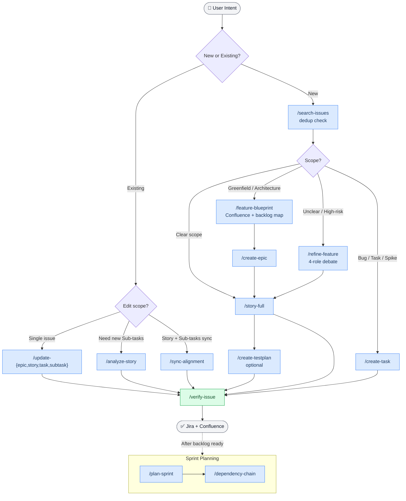

# atlassian-pm

> Claude Code plugin for AI-powered Jira & Confluence automation — create Epics, Stories, Sub-tasks, and plan Sprints using natural language.

[](https://github.com/wasikarn/atlassian-pm)
[](LICENSE)
[](https://claude.ai/claude-code)

Describe what you need in plain English (or Thai) — Claude explores your codebase, writes properly-formatted Jira ADF, passes a quality gate, and publishes. Hooks enforce 10 hard rules automatically and block silent failures before they happen. A local SQLite cache reduces Jira API token consumption by **80–90%**.

---

## Quick Start

```bash
/plugin marketplace add wasikarn/atlassian-pm
/plugin install atlassian-pm@atlassian-pm
/atlassian-pm:setup
```

Claude will ask for your Jira site, project key, and board ID — then configure everything automatically.

> Requires Claude Code with plugin support. If `/plugin install` is unavailable, see [Manual Installation](#manual-installation).

---

## How It Works

```text
You  →  /atlassian-pm:story-full  →  Explore codebase  →  Write ADF  →  QG ≥ 90%  →  Jira
```

1. Describe what you need in natural language
2. Claude explores your codebase to find real implementation paths
3. Writes properly-structured ADF JSON and scores it against a quality gate
4. Publishes to Jira via `acli` — MCP handles field updates and metadata

### Workflow



---

## Commands

All commands are available as `/atlassian-pm:<name>` after installing the plugin.

### Feature Design

| Command | Description |
| --- | --- |
| `/atlassian-pm:feature-blueprint` | 5-role debate → Confluence blueprint + backlog map (S/M/L tiers) |
| `/atlassian-pm:refine-feature` | 4-role debate for unclear or high-risk requirements |

### Issue Creation

| Command | Description |
| --- | --- |
| `/atlassian-pm:story-full` | **Recommended** — Story + Sub-tasks in one workflow |
| `/atlassian-pm:create-epic` | Epic + Confluence doc with RICE scoring |
| `/atlassian-pm:create-task` | Task: `tech-debt`, `bug`, `chore`, or `spike` |
| `/atlassian-pm:analyze-story ABC-123` | Explore codebase → create Sub-tasks for existing Story |
| `/atlassian-pm:create-testplan ABC-123` | Test Plan + `[QA]` Sub-tasks from Story ACs |

### Issue Updates

| Command | Description |
| --- | --- |
| `/atlassian-pm:update-story ABC-123` | Edit Story — ACs, scope, description |
| `/atlassian-pm:update-epic ABC-123` | Edit Epic — scope, RICE, metrics |
| `/atlassian-pm:update-task ABC-123` | Edit Task — format, details |
| `/atlassian-pm:update-subtask ABC-123` | Edit Sub-task — format, content |
| `/atlassian-pm:sync-alignment ABC-123` | Bidirectional sync: Story ↔ Sub-tasks ↔ Confluence |

### Search & Quality

| Command | Flags | Description |
| --- | --- | --- |
| `/atlassian-pm:search-issues` | | Dedup check before creating |
| `/atlassian-pm:verify-issue ABC-123` | `--with-subtasks` `--fix` `--dry-run` | ADF format + INVEST criteria check |
| `/atlassian-pm:assign ABC-123 [name]` | | Assign issue (bypasses MCP silent failure) |

### Sprint Planning

| Command | Flags | Description |
| --- | --- | --- |
| `/atlassian-pm:plan-sprint` | `--sprint 123` `--carry-over-only` | 8-phase planning: capacity + carry-over + assign |
| `/atlassian-pm:dependency-chain` | | Critical path + swim lane analysis |
| `/atlassian-pm:activity-report` | | Work activity report from session history |

### Confluence

| Command | Description |
| --- | --- |
| `/atlassian-pm:create-doc` | Create page: `tech-spec`, `adr`, `parent` |
| `/atlassian-pm:update-doc` | Update or move a Confluence page |

---

## Usage Examples

### Full Feature Workflow

```bash
# 1. Design (multi-role debate → Confluence + backlog map)
/atlassian-pm:feature-blueprint
→ "Build a real-time notification system"

# 2. Dedup check
/atlassian-pm:search-issues

# 3. Epic + Confluence doc
/atlassian-pm:create-epic

# 4. Story + Sub-tasks (explores codebase automatically)
/atlassian-pm:story-full

# 5. QA sub-tasks (optional)
/atlassian-pm:create-testplan ABC-123

# 6. Verify the full tree
/atlassian-pm:verify-issue ABC-123 --with-subtasks
```

### Unclear Requirements

```text
# 4-role debate before writing Jira artifacts
/atlassian-pm:refine-feature
→ Roles: PO × Tech Lead × Engineer × QA
→ Output: revised story + refined ACs → ready for /story-full
```

### Sprint Planning Example

```text
/atlassian-pm:plan-sprint
→ Discovery → Capacity → Carry-over → Prioritize
→ Distribute → Risk → Review → Execute
```

### Update with Cascade

```bash
# Story only
/atlassian-pm:update-story ABC-123

# Story + Sub-tasks + Confluence (all in sync)
/atlassian-pm:sync-alignment ABC-123
```

---

## Online Installation (Recommended)

Install without cloning the repo — Claude handles everything.

> **Before you begin** — have these ready:
>
> - Atlassian API token ([Account Settings → Security → API tokens](https://id.atlassian.net/manage-profile/security/api-tokens))
> - Jira site URL (e.g. `your-company.atlassian.net`)
> - Jira project key (e.g. `ABC`)
> - Board ID (optional — can look up after setup)
>
> Setup takes **2–3 minutes** (downloads acli, uv, and syncs the cache server venv).
> Claude Code must be **restarted once** after setup to activate the MCP server.

**Step 1** — Add marketplace

```text
/plugin marketplace add wasikarn/atlassian-pm
```

**Step 2** — Install plugin

```text
/plugin install atlassian-pm@atlassian-pm
```

**Step 3** — Run setup

```text
/atlassian-pm:setup
```

Claude will ask for your Jira site, project key, and board ID, then write the config and configure git filters automatically.

`/atlassian-pm:setup` configures:

- ✓ acli (Jira CLI) — installed + authenticated
- ✓ mcp-atlassian — registered as user-scoped MCP server
- ✓ `~/.config/atlassian/.env` — Jira/Confluence credentials
- ✓ `~/.claude/CLAUDE.md` — Atlassian settings block
- ✓ git smudge/clean filters — placeholder conversion

> **Note:** The marketplace install commands above are based on Claude Code's plugin system. If these commands are not yet available in your version, use the manual installation below.

---

## Prerequisites

| Tool | Purpose | Install |
| --- | --- | --- |
| [Homebrew](https://brew.sh) | macOS package manager | `/bin/bash -c "$(curl -fsSL https://raw.githubusercontent.com/Homebrew/install/HEAD/install.sh)"` |
| [Claude Code](https://claude.ai/claude-code) | AI agent runtime | `npm i -g @anthropic-ai/claude-code` |
| [acli](https://bobswift.atlassian.net/wiki/spaces/ACLI/overview) | Jira ADF publishing | `brew tap atlassian/homebrew-acli && brew install acli` |
| [mcp-atlassian](https://github.com/sooperset/mcp-atlassian) | Jira/Confluence MCP | configured by setup (Phase 4) |
| Python 3.11+ | REST API scripts + cache server | `brew install python@3.11` |

> **uv** (Python package manager) is required for the cache server: `brew install uv`

---

## Manual Installation

### 1. Clone

```bash
git clone https://github.com/wasikarn/atlassian-pm atlassian-pm
cd atlassian-pm
```

### 2. Create config

```bash
cp config/project-config.json.template .claude/project-config.json
```

Edit `.claude/project-config.json`:

```jsonc
{
  "jira": {
    "site": "your-company.atlassian.net",  // ← your Jira domain
    "project_key": "ABC",                   // ← your project key
    "board_id": 1                           // ← from jira_get_agile_boards()
  },
  "confluence": { "site": "your-company.atlassian.net", "space_key": "ABC" },
  "team": { "members": [...] }
}
```

> Real config is gitignored — only the template with placeholder values is committed.

### 3. Authenticate acli

```bash
echo "<api-token>" | acli jira auth login \
  --site https://your-site.atlassian.net \
  --email your@email.com \
  --token
```

Get your token at **Atlassian Account → Security → API tokens**.

### 4. Create credentials file

```bash
mkdir -p ~/.config/atlassian
chmod 700 ~/.config/atlassian
cat > ~/.config/atlassian/.env << 'EOF'
JIRA_URL=https://your-site.atlassian.net
JIRA_USERNAME=your@email.com
JIRA_API_TOKEN=<your-api-token>
CONFLUENCE_URL=https://your-site.atlassian.net/wiki
CONFLUENCE_USERNAME=your@email.com
CONFLUENCE_API_TOKEN=<your-api-token>
EOF
chmod 600 ~/.config/atlassian/.env
```

Get your API token at: **Atlassian Account → Security → API tokens**
One token works for both Jira and Confluence. Tokens expire in ≤365 days.

### 5. Configure MCP

```bash
claude mcp add --scope user mcp-atlassian -- \
  uvx --no-cache mcp-atlassian==0.21.0 \
  --env-file ~/.config/atlassian/.env \
  --jira-projects-filter=YOUR_PROJECT_KEY \
  --confluence-spaces-filter=YOUR_SPACE_KEY
```

> **Note:** `~/.config/atlassian/.env` must exist first (Step 4). Replace `YOUR_PROJECT_KEY` with your Jira project key (e.g. `BEP`).

### 6. Run setup

```bash
./scripts/setup.sh
```

Configures `~/.claude/CLAUDE.md` with your Jira settings and sets up git smudge/clean filters.

### 7. Install Jira cache server

```bash
UV_PROJECT_ENVIRONMENT="$HOME/.claude/plugins/data/atlassian-pm-atlassian-pm/venv" \
  uv sync --project mcp-servers/jira-cache-server --extra embeddings
```

Reduces token consumption 80–90% for repeated lookups via local SQLite + FTS5. Omit `--extra embeddings` to skip semantic search (~640MB PyTorch/sentence-transformers).

### 8. Load plugin

```bash
# This session only
claude --plugin-dir /path/to/atlassian-pm

# Permanently — add to ~/.claude/settings.json
{ "pluginDirs": ["/path/to/atlassian-pm"] }
```

### Verify

```bash
acli jira auth status
# Inside Claude Code:
/atlassian-pm:doctor
```

---

## Architecture

```text
Claude Code ──skills──► acli (ADF JSON) ──────────────────────► Jira Cloud
    │                                                                  ▲
    ├── MCP ──► mcp-atlassian ──────────────────────────────────────── ┤
    │                                                                  │
    ├── MCP ──► jira-cache-server ── SQLite + FTS5 ──► Jira REST API v3
    │                └─ (~/.claude/plugins/data/atlassian-pm-atlassian-pm/jira.db)
    │
    ├── MCP ──► Confluence, Figma, GitHub
    │
    └── Python ──► atlassian-scripts/lib/ (REST API helpers)
```

| Layer | Tool | Why |
| --- | --- | --- |
| Descriptions | `acli --from-json` (ADF) | MCP produces unformatted output |
| Fields (assignee, sprint, labels) | MCP `jira_update_issue` | More reliable for metadata |
| Sub-task creation | MCP create → acli edit | MCP may silently drop parent |
| ML dependencies | venv outside project tree | PyTorch + sentence-transformers ~640MB |

---

## Configuration

All project-specific values live in `.claude/project-config.json` — the single source of truth. Only the template is committed; real config is gitignored.

| File | Loaded | Contains |
| --- | --- | --- |
| `.claude/project-config.json` | Every session | Jira fields, team roster, services, environments |
| `.claude/project-config-team-detail.json` | Sprint planning only | Git evidence, bus factor, velocity history *(gitignored — create from template)* |

### Git Filter — Automatic Placeholder Conversion

```text
Committed:    {{PROJECT_KEY}}-XXX   ← always placeholders
                      │
               [smudge on checkout]
                      ↓
Working tree: ABC-XXX               ← real values
                      │
               [clean on commit]
                      ↓
Staged:       {{PROJECT_KEY}}-XXX   ← always placeholders
```

| Placeholder | Example |
| --- | --- |
| `{{PROJECT_KEY}}` | `ABC` |
| `{{JIRA_SITE}}` | `acme-corp.atlassian.net` |
| `{{SPACE_KEY}}` | `ABC` |
| `{{COMPANY}}` | `Acme Corp` |

---

## Project Structure

```text
.claude-plugin/plugin.json              ← Plugin manifest
.claude-plugin/marketplace.json         ← Plugin catalog (version lives here — not in plugin.json)
.mcp.json                               ← MCP server config
.claude/project-config.json             ← Real config (gitignored)
config/project-config.json.template     ← Template with placeholders (tracked)

skills/                        ← 1 directory = 1 slash command
├── story-full/                ← Composite: explore + write + publish
├── create-{epic,task,doc,testplan}/
├── update-{epic,story,task,subtask,doc}/
├── analyze-story/
├── sync-alignment/            ← Bidirectional Jira + Confluence sync
├── plan-sprint/               ← 8-phase sprint planning
├── dependency-chain/          ← Critical path + swim lanes
├── search-issues/, verify-issue/, activity-report/, assign/
├── atlassian-scripts/         ← Python REST API scripts (16 utilities)
└── shared-references/         ← Docs loaded by skills (23 files)
    ├── templates.md           ← ADF templates (Epic, Story, Sub-task, Task)
    ├── hr-rules.md            ← Hard rule definitions (HR1–HR10)
    └── troubleshooting.md     ← Common failures + fixes

agents/                                  ← 17 subagent definitions (3-layer architecture)
│
│  Layer 1 — Foundation (compact output, token-optimized)
├── code-explorer.md (haiku)             ← Codebase exploration; Memory-First Protocol; --domain flag
├── issue-bootstrap.md (haiku)           ← Pre-fetch issue context; --preset flags; BOOTSTRAP_COMPACT
├── issue-reader.md (haiku)              ← Fast Jira issue fetch (deprecated → issue-bootstrap)
├── jira-search.md (haiku)               ← Duplicate confidence scoring (EXACT/HIGH/MEDIUM/LOW)
├── quality-gate.md (haiku)              ← ADF quality scoring; Pattern Memory; Team Convention Check
├── pr-description-writer.md (haiku)     ← Generate PR description from branch + issue
├── pr-review-jira-sync.md (haiku)       ← Sync merged PR back to Jira (transition + comment)
├── velocity-tracker.md (haiku)          ← Velocity history; anomaly detection (1.5σ); per-member stats
│
│  Layer 2 — Analysis (expert reasoning, domain knowledge)
├── story-writer.md (sonnet)             ← ADF JSON; Convention Memory; Service-Aware AC Defaults
├── alignment-checker.md (sonnet)        ← AC Coverage Matrix; Predictive Risk Flags; Scope Drift
├── backlog-groomer.md (sonnet)          ← WSJF scoring; aging alerts; Top Candidates output
├── retrospective-analyst.md (sonnet)    ← Cross-Sprint Comparison; Team Health Score (0-100)
├── sprint-planner.md (sonnet)           ← Risk-Adjusted Capacity; 3 Scenario Planning
│
│  Layer 3 — Synthesis (cross-domain specialists, new in v1.1.0)
├── estimation-calibrator.md (sonnet)    ← SP calibration from historical similarity; HIGH/MEDIUM/LOW confidence
├── risk-forecaster.md (sonnet)          ← 4-dimension delivery risk; named mitigations; adjusted scenarios
├── adf-surgeon.md (haiku)               ← Structural ADF repair; 10 known Jira quirks; content-safe
└── team-pattern-advisor.md (sonnet)     ← Multi-sprint strategic patterns; ≥3 data point threshold

hooks/                         ← 42 Python hook scripts
├── hooks.json                 ← Plugin hook manifest
├── pre_hr*.py                 ← Block violations before tool execution
└── post_hr*.py                ← Confirm post-execution state

mcp-servers/jira-cache-server/ ← Local Jira cache (SQLite + FTS5 + embeddings)
scripts/
├── setup.sh                   ← One-command setup (idempotent)
└── git_filter.py              ← Smudge/clean placeholder conversion
```

---

## Tips

**Always search first** — run `/atlassian-pm:search-issues` before creating anything to prevent duplicates.

**Always verify after** — run `/atlassian-pm:verify-issue ABC-XXX --with-subtasks` to check ADF format, INVEST criteria, and alignment across the full tree.

**Save tokens** — run `cache_sprint_issues(sprint_id=...)` before sprint planning to pre-cache all issues. Repeated reads cost 0 API tokens.

**Let Claude explore** — `/atlassian-pm:analyze-story` always explores the codebase before creating Sub-tasks. Never skip — generic sub-tasks miss real implementation paths.

**Dev hot-reload** — after editing skill or agent files, use `/reload-plugins` in Claude Code.

**Plugin development** — `plugin.json` must NOT contain a `hooks` field (causes duplicate hook error) or a `version` field (version lives in `.claude-plugin/marketplace.json` only). `marketplace.json` must be in `.claude-plugin/` (not repo root).
