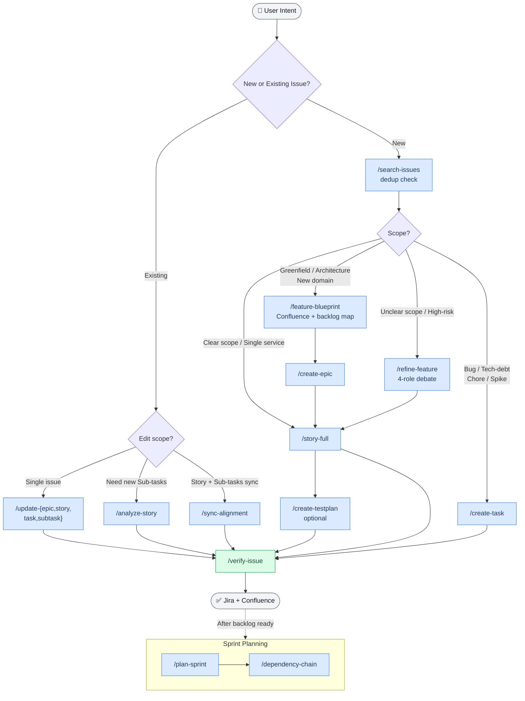

# atlassian-pm

> AI-powered Jira and Confluence automation via Claude Code plugin — create Epics, Stories, Sub-tasks, and plan Sprints using natural language.

Create Epics, User Stories, Sub-tasks, and plan Sprints using natural language. The plugin enforces quality gates, prevents silent failures through hook-based guardrails, and reduces Jira API token consumption by 80–90% via a local SQLite cache.

---

## Contents

- [How It Works](#how-it-works)
- [Architecture](#architecture)
- [Prerequisites](#prerequisites)
- [Installation](#installation)
- [Plugin Commands](#plugin-commands)
- [Usage Examples](#usage-examples)
- [Project Structure](#project-structure)
- [Configuration System](#configuration-system)
- [Tips](#tips)

---

## How It Works

```text
You (natural language) → Claude Code + atlassian-pm plugin → Jira / Confluence
```

1. You describe what you need in plain language (e.g. "Create a coupon system story for admin")
2. Claude uses the skill workflow: **Explore codebase → Write ADF → Quality Gate ≥ 90% → Publish**
3. Hooks automatically enforce hard rules (HR1–HR10) and block silent failures before they happen
4. A local cache (SQLite + FTS5) stores Jira data so repeated reads don't consume API tokens

### Workflow Overview



---

## Architecture

```text
Claude Code ──skills──► acli (ADF JSON) ──────────────────► Jira Cloud
    │                                                              ▲
    ├── MCP ──► mcp-atlassian ────────────────────────────────────┤
    │                                                              │
    ├── MCP ──► jira-cache-server ──SQLite + FTS5 ──► Jira REST API v3
    │                └─ (~/.cache/jira-generator/jira.db)
    │
    ├── MCP ──► Confluence, Figma, GitHub
    │
    └── Python ──► atlassian-scripts/lib/ (REST API helpers)
```

**Key design decisions:**

| Layer | Tool | Why |
| --- | --- | --- |
| Descriptions | `acli --from-json` (ADF format) | MCP produces unformatted output |
| Fields (assignee, sprint, labels) | MCP `jira_update_issue` | Simpler and more reliable for field updates |
| Sub-task creation | MCP create → acli edit (two-step) | MCP may silently drop parent; acli handles description |
| ML dependencies | venv outside project tree | PyTorch + sentence-transformers are ~640MB |

---

## Prerequisites

Install all four tools before running setup:

| Tool | Purpose | Install |
| --- | --- | --- |
| [Claude Code](https://claude.com/claude-code) | AI agent runtime | `npm i -g @anthropic-ai/claude-code` |
| [acli](https://bobswift.atlassian.net/wiki/spaces/ACLI/overview) | Jira ADF descriptions | `brew install atlassian-cli` |
| [mcp-atlassian](https://github.com/sooperset/mcp-atlassian) | Jira/Confluence MCP server | `uvx mcp-atlassian` (auto-installed) |
| Python 3.x | REST API scripts | Pre-installed on macOS |

> `uv` is required for the Jira Cache Server (Python package manager). Install: `curl -LsSf https://astral.sh/uv/install.sh | sh`

---

## Installation

### Step 1 — Clone and enter the project

```bash
git clone <repo-url> jira-generator
cd jira-generator
```

---

### Step 2 — Create project config

Copy the template and fill in your real values (Jira site, team members, service paths):

```bash
cp config/project-config.json.template .claude/project-config.json
```

Then edit `.claude/project-config.json`:

```jsonc
{
  "jira": {
    "site": "your-company.atlassian.net",   // ← your Jira domain
    "project_key": "ABC",                    // ← your project key
    "board_id": 1                            // ← from jira_get_agile_boards()
  },
  "confluence": {
    "site": "your-company.atlassian.net",
    "space_key": "ABC"
  },
  "team": {
    "members": [...]                         // ← your team roster
  }
}
```

> The template ships with safe placeholder values. Real config is gitignored — never committed.

---

### Step 3 — Configure acli

```bash
acli jira login \
  --server https://your-site.atlassian.net \
  --user your@email.com \
  --token <api-token>
```

Generate your API token at: **Atlassian Account → Security → API tokens**

---

### Step 4 — Configure MCP servers

Add to your Claude Code settings (`~/.claude/settings.json`):

```json
{
  "mcpServers": {
    "mcp-atlassian": {
      "command": "uvx",
      "args": ["mcp-atlassian"],
      "env": {
        "JIRA_URL": "https://your-site.atlassian.net",
        "JIRA_USERNAME": "your@email.com",
        "JIRA_API_TOKEN": "<api-token>",
        "CONFLUENCE_URL": "https://your-site.atlassian.net/wiki",
        "CONFLUENCE_USERNAME": "your@email.com",
        "CONFLUENCE_API_TOKEN": "<api-token>"
      }
    }
  }
}
```

> For VSCode, add to your workspace or user `settings.json` under the Claude Code extension settings.

---

### Step 5 — Configure credentials for Python scripts

Python scripts in `atlassian-scripts/` load credentials from `~/.config/atlassian/.env`:

```bash
mkdir -p ~/.config/atlassian
cat > ~/.config/atlassian/.env << 'EOF'
JIRA_URL=https://your-site.atlassian.net
JIRA_USERNAME=your@email.com
JIRA_API_TOKEN=<api-token>
CONFLUENCE_URL=https://your-site.atlassian.net/wiki
CONFLUENCE_USERNAME=your@email.com
CONFLUENCE_API_TOKEN=<api-token>
EOF
```

---

### Step 6 — Run setup

```bash
./scripts/setup.sh
```

This single command does four things:

1. Creates `.claude/project-config.json` from template (if missing)
2. Installs the `sync-skills` CLI to `~/.local/bin/`
3. Syncs skills to `~/.claude/skills/`
4. Configures git smudge/clean filters (auto placeholder↔real value conversion)

> If `~/.local/bin` is not in your `PATH`, add `export PATH="$HOME/.local/bin:$PATH"` to your shell profile.

---

### Step 7 — Install Jira Cache Server (recommended)

The cache server reduces token consumption by 80–90% for repeated Jira queries.

```bash
cd mcp-servers/jira-cache-server
uv sync --extra embeddings
```

The `.mcp.json` at the project root auto-registers the cache server when the plugin is loaded via `uv run`, which automatically uses the local venv. The `--extra embeddings` flag installs `sqlite-vec` and `sentence-transformers` for semantic similarity search — skip this if you only need keyword search (FTS5).

---

### Step 8 — Load the plugin

```bash
# Load for this session only
claude --plugin-dir /path/to/jira-generator

# Or add permanently to ~/.claude/settings.json:
{
  "pluginDirs": ["/path/to/jira-generator"]
}
```

Skills are available as `/atlassian-pm:<name>` (e.g. `/atlassian-pm:story-full`).

---

### Verify Setup

```bash
# Check plugin structure is valid
claude plugin validate .

# Check acli is authenticated
acli jira project list --server https://your-site.atlassian.net

# Inside Claude Code — should list your recent issues
/atlassian-pm:search-issues
```

---

## Plugin Commands

Load the plugin (`claude --plugin-dir .`), then use `/atlassian-pm:<command>`.

### Feature Design

| Command | Description |
| --- | --- |
| `/atlassian-pm:feature-blueprint` | Multi-perspective blueprint on Confluence — 5 roles debate (PO, Domain Expert, TL, Engineer, QA). S/M/L tiers. |
| `/atlassian-pm:refine-feature` | 4-role debate to refine unclear requirements or high-risk stories before creating Jira artifacts |

### Issue Creation

| Command | Description |
| --- | --- |
| `/atlassian-pm:story-full` | Create Story + Sub-tasks in one go **(preferred)** |
| `/atlassian-pm:create-epic` | Create Epic + Confluence Epic Doc with RICE scoring |
| `/atlassian-pm:create-task` | Create Task: `tech-debt`, `bug`, `chore`, or `spike` |
| `/atlassian-pm:analyze-story ABC-XXX` | Read Story → explore codebase → create Sub-tasks |
| `/atlassian-pm:create-testplan ABC-XXX` | Create Test Plan + `[QA]` Sub-tasks from Story |

### Issue Updates

| Command | Description |
| --- | --- |
| `/atlassian-pm:update-story ABC-XXX` | Edit Story — add/edit ACs, scope |
| `/atlassian-pm:update-epic ABC-XXX` | Edit Epic — adjust scope, RICE, metrics |
| `/atlassian-pm:update-task ABC-XXX` | Edit Task — migrate format, add details |
| `/atlassian-pm:update-subtask ABC-XXX` | Edit Sub-task — format, content |
| `/atlassian-pm:sync-alignment ABC-XXX` | Sync Story + Sub-tasks bidirectionally (+ Confluence if exists) |

### Search and Quality

| Command | Flags | Description |
| --- | --- | --- |
| `/atlassian-pm:search-issues` | | Search before creating (prevent duplicates) |
| `/atlassian-pm:verify-issue ABC-XXX` | `--with-subtasks` · `--fix` · `--dry-run` | Check ADF format, INVEST criteria, language |
| `/atlassian-pm:assign ABC-XXX [name]` | | Assign issue to team member (bypasses MCP silent failure) |

### Sprint Planning

| Command | Flags | Description |
| --- | --- | --- |
| `/atlassian-pm:plan-sprint` | `--sprint 123` · `--carry-over-only` | Sprint planning: carry-over + capacity + assign |
| `/atlassian-pm:dependency-chain` | | Dependency graph, critical path, swim lanes |
| `/atlassian-pm:activity-report` | | Work activity report from session history |

### Confluence Documentation

| Command | Description |
| --- | --- |
| `/atlassian-pm:create-doc` | Create page: `tech-spec`, `adr`, `parent` |
| `/atlassian-pm:update-doc` | Update or move a Confluence page |

---

## Usage Examples

### Full Feature Workflow (Blueprint → Jira)

```text
# 1. Design the feature with multi-role debate (output: Confluence page + backlog map)
/atlassian-pm:feature-blueprint
→ "Build a real-time notification system for the platform"

# 2. Check no duplicates exist
/atlassian-pm:search-issues

# 3. Create Epic with Confluence doc and RICE score
/atlassian-pm:create-epic

# 4. Create Story + Sub-tasks in one workflow
/atlassian-pm:story-full

# 5. Optionally create QA sub-tasks
/atlassian-pm:create-testplan ABC-123

# 6. Verify quality (ADF, INVEST, language)
/atlassian-pm:verify-issue ABC-123 --with-subtasks
```

**Example:** `/atlassian-pm:story-full` → "Build a coupon system for admin" → Claude generates Story with `[BE]` and `[FE-Admin]` Sub-tasks, each with implementation paths from codebase exploration.

---

### Clarify Before Writing (Unclear Requirements)

```text
# Run 4-role debate when requirements are unclear or high-risk
/atlassian-pm:refine-feature ABC-123

# Roles: PO (scope/value) × Tech Lead (feasibility/risk)
#      × Engineer (effort/implementation) × QA (edge cases/testability)
# Output: revised story narrative + refined ACs ready for /story-full
```

---

### Plan a Sprint

```text
/atlassian-pm:plan-sprint

# 8-phase workflow:
# Discovery → Capacity → Carry-over → Prioritize
# → Distribute → Risk → Review → Execute
```

---

### Update with Cascade

```text
# Edit Story only
/atlassian-pm:update-story ABC-123

# Edit Story AND cascade to Sub-tasks + sync Confluence
/atlassian-pm:sync-alignment ABC-123
```

---

## Project Structure

```text
.claude-plugin/plugin.json                ← Plugin manifest (name: atlassian-pm)
.mcp.json                                 ← MCP server config (jira-cache-server)
.claude/project-config.json               ← Your real config — loaded every session (gitignored)
.claude/project-config-team-detail.json   ← Sprint planning detail — loaded on-demand (gitignored)
config/project-config.json.template       ← Template with safe placeholders (tracked)

skills/                             ← Skill definitions (1 dir = 1 slash command)
├── story-full/                     ← Composite: PO + TA in one workflow
├── create-{epic,task,doc,testplan}/
├── update-{epic,story,task,subtask,doc}/
├── analyze-story/
├── sync-alignment/                 ← Bidirectional sync (Jira + Confluence)
├── plan-sprint/                    ← Sprint planning: carry-over + capacity + assign
├── dependency-chain/               ← Critical path + swim lane analysis
├── search-issues/, verify-issue/, activity-report/, assign/
│
├── atlassian-scripts/              ← Python REST API scripts (non-user-invocable)
│   ├── lib/                        ← auth, jira_api, converters, exceptions
│   └── *.py                        ← 16 utility scripts
│
└── shared-references/              ← Reusable docs loaded by skills (23 files)
    ├── templates.md                ← All ADF templates (Epic, Story, Sub-task, Task)
    ├── tools.md                    ← Field presets and tool selection rules
    ├── writing-style.md            ← Thai + English style guide
    ├── verification-checklist.md   ← Quality gate criteria
    ├── hr-rules.md                 ← Hard rule definitions (HR1–HR10)
    └── troubleshooting.md          ← Common failure patterns + fixes

agents/                             ← 8 subagent definitions
├── code-explorer.md (haiku)        ← Codebase exploration
├── issue-reader.md (haiku)         ← Fast Jira issue fetch
├── jira-search.md (haiku)          ← JQL search + dedup
├── issue-bootstrap.md (haiku)      ← Pre-gather full issue context
├── quality-gate.md (haiku)         ← ADF quality scoring
├── story-writer.md (sonnet)        ← ADF JSON generation
├── alignment-checker.md (sonnet)   ← Epic→Story→Subtask alignment
└── sprint-planner.md (opus)        ← Sprint capacity planning

hooks/                              ← 39 Python hook scripts
├── hooks.json                      ← Plugin hook manifest
├── pre_hr*.py                      ← Block rule violations before tool execution
└── post_hr*.py                     ← Track and confirm post-execution state

mcp-servers/jira-cache-server/      ← MCP server: local Jira cache
├── server.py                       ← MCP entry point + 9 tool handlers
└── jira_cache/
    ├── cache.py                    ← SQLite + FTS5 (issues, sprints, searches)
    └── embeddings.py               ← sqlite-vec + sentence-transformers

scripts/
├── setup.sh                        ← One-command setup (idempotent)
├── git_filter.py                   ← Placeholder↔value smudge/clean filter
├── sprint/                         ← Sprint batch utilities (5 scripts)
└── confluence/                     ← Confluence page scripts

tasks/                              ← Generated ADF JSON outputs (gitignored)
CLAUDE.md                           ← Agent instructions (passive context)
```

> The jira-cache-server venv is at `mcp-servers/jira-cache-server/.venv/` (~640MB with embeddings). The SQLite database is stored separately at `~/.cache/jira-generator/jira.db`.

---

## Configuration System

All project-specific values (Jira site, team, services, domains) live in `.claude/project-config.json` — the **single source of truth**. The repo tracks only the `.template` version with placeholder values; real config is gitignored.

### Config Files

| File | Loaded | Contains |
| --- | --- | --- |
| `.claude/project-config.json` | Every session (passive context) | Jira fields, team roster (name/role/skill_profile/throughput), services, environments |
| `.claude/project-config-team-detail.json` | On-demand (sprint planning only) | git_evidence, bus_factor, growth_tracks, review_cost, velocity history |

This split keeps session-start token cost low — the detail file is only read when `/atlassian-pm:plan-sprint` runs.

### Git Filter: Automatic Placeholder Conversion

```text
Git repo (committed):  {{PROJECT_KEY}}-XXX   ← always placeholders
                              │
                        [smudge filter]       ← on checkout / pull
                              ↓
Working tree:          ABC-XXX                ← real values (local dev)
                              │
                        [clean filter]        ← on add / commit
                              ↓
Git staging:           {{PROJECT_KEY}}-XXX   ← always placeholders
```

After `./scripts/setup.sh`, the git filters run automatically. No manual steps needed — working tree shows real values, commits contain only placeholders.

### Placeholder Reference

| Placeholder | Example real value |
| --- | --- |
| `{{PROJECT_KEY}}` | `ABC` |
| `{{JIRA_SITE}}` | `acme-corp.atlassian.net` |
| `{{CONFLUENCE_SITE}}` | `acme-corp.atlassian.net` |
| `{{SPACE_KEY}}` | `ABC` |
| `{{COMPANY}}` | `Acme Corp` |
| `{{COMPANY_LOWER}}` | `acme` |
| `{{START_DATE_FIELD}}` | `{{START_DATE_FIELD}}` |
| `{{SPRINT_FIELD}}` | `{{SPRINT_FIELD}}` |
| `{{SLOT_1}}` .. `{{SLOT_N}}` | Team member names from `project-config.json → team.members[]` |

### Cloning to Another Project

```bash
# 1. Copy template
cp config/project-config.json.template .claude/project-config.json

# 2. Edit with your project's values
vi .claude/project-config.json

# 3. Run setup — configures git filters, installs CLI tools
./scripts/setup.sh
```

**Manual override (debugging):**

```bash
python scripts/configure_project.py --apply          # apply placeholders → real values
python scripts/configure_project.py --revert --apply # revert real values → placeholders
```

---

## Tips

**Before creating anything:**

- Always run `/atlassian-pm:search-issues` first — prevents duplicate issues

**After creating or updating:**

- Always run `/atlassian-pm:verify-issue ABC-XXX` — catches format and alignment issues
- Add `--with-subtasks` to check the entire tree at once

**Token savings:**

- Before sprint planning, run `cache_sprint_issues(sprint_id=...)` to pre-cache all issues
- Repeated lookups cost 0 tokens after first fetch (local SQLite, no API call)

**Codebase exploration:**

- `/atlassian-pm:analyze-story` always explores the codebase before creating Sub-tasks
- Never skip this step — generic sub-tasks miss real implementation paths

**Development workflow:**

- After editing skill or agent files, use `/reload-plugins` in Claude Code to hot-reload
- Use `claude plugin validate .` to check for manifest errors before testing

**Language:**

- Jira descriptions use Thai + English transliteration for technical terms (endpoint, API, component, etc.)
- ADF format is handled automatically via `acli --from-json` — no manual formatting needed
