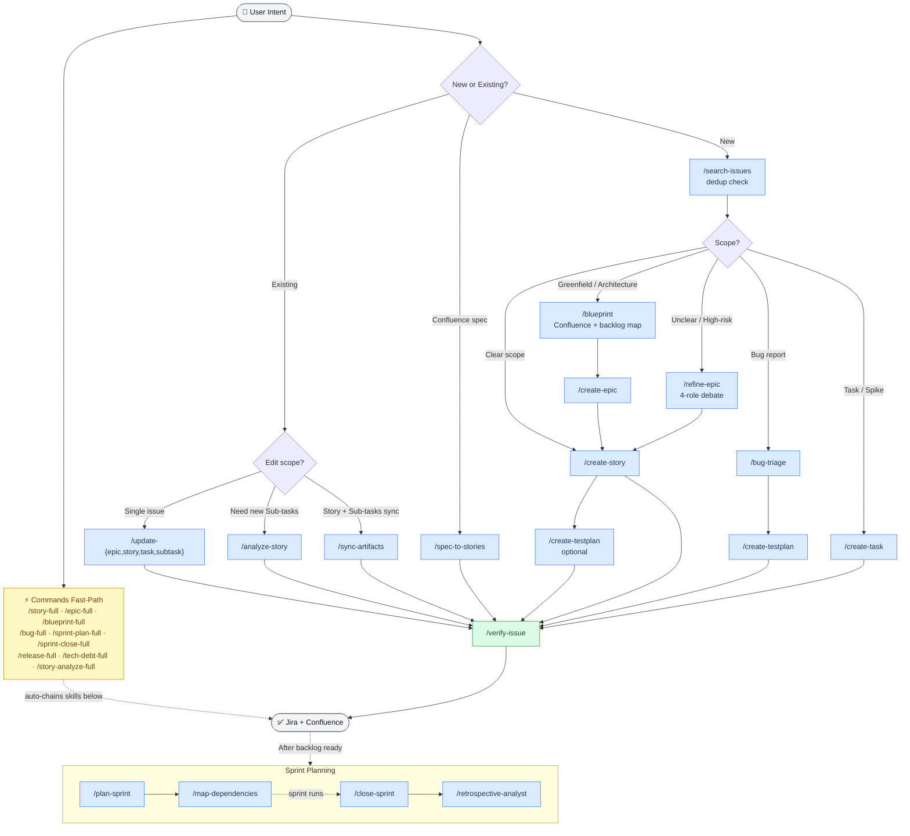

# atlassian-pm

> Claude Code plugin for AI-powered Jira & Confluence automation — create Epics, Stories, Sub-tasks, and plan Sprints using natural language. Each skill embeds domain-expert notes (Scrum, SAFe, ITIL, DORA, IEEE 829) alongside the workflow steps.

[](https://github.com/wasikarn/atlassian-pm)
[](LICENSE)
[](https://claude.ai/claude-code)

Describe what you need in plain English (or Thai) — Claude explores your codebase, writes properly-formatted Jira ADF, passes a quality gate, and publishes. Hooks enforce 10 hard rules automatically and block silent failures before they happen. A local SQLite cache reduces Jira API token consumption by **80–90%**.

---

## Quick Start

```bash
/plugin marketplace add wasikarn/atlassian-pm
/plugin install atlassian-pm@atlassian-pm
/atlassian-pm:setup
```

Claude will ask for your Jira site, project key, and board ID — then configure everything automatically.

> Requires Claude Code with plugin support. If `/plugin install` is unavailable, see [Manual Installation](#manual-installation).

---

## How It Works

```text
⚡ Commands:  /story-full · /epic-full · /bug-full · /sprint-plan-full · …  (chains skills end-to-end with confirmation gates)
   Skills:   /atlassian-pm:create-story  →  Explore codebase  →  Write ADF  →  QG ≥ 90%  →  Jira
```

1. Describe what you need in natural language (or pick a Command for the full end-to-end chain)
2. Claude explores your codebase to find real implementation paths
3. Writes properly-structured ADF JSON and scores it against a quality gate
4. Publishes to Jira via `acli` — MCP handles field updates and metadata

### Workflow



---

## Commands

End-to-end orchestration chains — the fastest way to get things done. Each command chains multiple skills in sequence with confirmation gates between stages. Invoked as `/name` (no namespace prefix).

| Command | Chains | Description |
| --- | --- | --- |
| `/story-full` | search-issues → create-story → verify-issue --with-subtasks | Full story creation with dedup + quality check |
| `/epic-full` | search-issues → create-epic → create-story → verify-issue --with-subtasks | Full epic + story creation end-to-end |
| `/blueprint-full` | blueprint → create-epic → create-story → verify-issue --with-subtasks | Greenfield feature from design to verified backlog |
| `/bug-full` | search-issues → bug-triage → create-testplan | Bug report with triage + test plan |
| `/qa-full` | create-testplan → execute-testplan | Create test plan + run against staging in one step |
| `/story-analyze-full` | analyze-story → verify-issue --with-subtasks | Break down existing story + verify alignment |
| `/sprint-plan-full` | plan-sprint → map-dependencies | Sprint planning with dependency critical path |
| `/sprint-close-full` | close-sprint → retrospective-analyst | Sprint closure + auto-generated retrospective |
| `/release-full` | plan-release → release-notes | Release plan + Confluence release notes |
| `/tech-debt-full` | scan-tech-debt → create-task (per item) | Scan and create tasks for selected tech-debt items |

---

## Skills

Individual steps invoked as `/atlassian-pm:<name>`. Use when you need finer control over a specific phase. Each skill is a multi-phase workflow with domain-expert notes (Scrum, SAFe, ITIL, DORA, IEEE 829) embedded alongside the steps. Grouped by primary user role — many skills are useful across roles.

### PM / Product Owner

Backlog ownership, sprint management, documentation, and reporting.

| Skill | Flags | Description |
| --- | --- | --- |
| `/atlassian-pm:blueprint` | | 5-role debate → Confluence blueprint + backlog map (S/M/L tiers) |
| `/atlassian-pm:refine-epic` | | 4-role debate for unclear or high-risk requirements |
| `/atlassian-pm:create-epic` | | Epic + Confluence doc with RICE scoring |
| `/atlassian-pm:plan-release` | | Multi-sprint release plan + Confluence page + Jira Fix Version |
| `/atlassian-pm:spec-to-stories 12345` | | Convert Confluence spec page → batch-create User Stories |
| `/atlassian-pm:search-issues` | | Dedup check before creating |
| `/atlassian-pm:assign-issue ABC-123 [name]` | | Assign issue (bypasses MCP silent failure) |
| `/atlassian-pm:plan-sprint` | `--sprint 123` `--carry-over-only` | 8-phase planning: capacity + carry-over + assign |
| `/atlassian-pm:close-sprint` | `--sprint 123` | Close sprint: triage incomplete → move → Confluence review |
| `/atlassian-pm:standup-report` | `--post` | Daily standup digest per assignee with anomaly detection |
| `/atlassian-pm:reschedule-sprint` | `--sprint 123 --shift +7` | Bulk-shift issue dates across a sprint or issue list |
| `/atlassian-pm:activity-report` | `--hours 48` | Work activity report from session history |
| `/atlassian-pm:create-doc` | | Create page: `tech-spec`, `adr`, `parent` |
| `/atlassian-pm:update-doc` | | Update or move a Confluence page |
| `/atlassian-pm:release-notes` | | Generate Confluence release notes from a Jira Fix Version |

### Engineer / Tech Lead

Story and task authoring, codebase exploration, issue maintenance, and quality gates.

| Skill | Flags | Description |
| --- | --- | --- |
| `/atlassian-pm:create-story` | | **Recommended** — Story + Sub-tasks in one workflow |
| `/atlassian-pm:analyze-story ABC-123` | | Explore codebase → create Sub-tasks for existing Story |
| `/atlassian-pm:create-task` | | Task: `tech-debt`, `bug`, `chore`, or `spike` |
| `/atlassian-pm:map-dependencies` | `--keys ABC-1,ABC-2` | Critical path + swim lane dependency analysis |
| `/atlassian-pm:update-story ABC-123` | | Edit Story — ACs, scope, description |
| `/atlassian-pm:update-epic ABC-123` | | Edit Epic — scope, RICE, metrics |
| `/atlassian-pm:update-task ABC-123` | | Edit Task — format, details |
| `/atlassian-pm:update-subtask ABC-123` | | Edit Sub-task — format, content |
| `/atlassian-pm:sync-artifacts ABC-123` | | Bidirectional sync: Story ↔ Sub-tasks ↔ Confluence |
| `/atlassian-pm:verify-issue ABC-123` | `--with-subtasks` `--fix` `--dry-run` | ADF format + INVEST criteria check |
| `/atlassian-pm:scan-tech-debt` | | Aggregate tech-debt/spike issues → Effort×Impact matrix on Confluence |

### QA / Tester

Test planning, bug intake, and acceptance verification.

| Skill | Description |
| --- | --- |
| `/atlassian-pm:create-testplan ABC-123` | Test Plan + `[QA]` Sub-tasks from Story ACs |
| `/atlassian-pm:execute-testplan ABC-123` | Run Google Sheet test cases via Playwright → write results back → create bug tickets |
| `/atlassian-pm:bug-triage` | Full triage: intake → P1/P2/P3 severity → dedup check → assign |

---

## Agents

Internal subagents dispatched automatically by skills and commands — not invoked directly. Organized in 3 layers by responsibility.

| Agent | Model | Role |
| --- | --- | --- |
| `code-explorer` | haiku | Codebase exploration; Memory-First Protocol |
| `issue-bootstrap` | haiku | Pre-fetch issue + parent + children context in one pass |
| `jira-search` | haiku | Duplicate detection with confidence scoring (EXACT/HIGH/MEDIUM/LOW) |
| `quality-gate` | sonnet | ADF quality scoring; Pattern Memory; Team Convention Check |
| `pr-description-writer` | haiku | Generate PR description from branch + issue |
| `pr-review-jira-sync` | haiku | Sync merged PR back to Jira (transition + comment) |
| `velocity-tracker` | haiku | Velocity history; anomaly detection (1.5σ); per-member stats |
| `sprint-transition-agent` | haiku | Batch sprint issue moves + sprint state transitions |
| `spec-parser-agent` | haiku | Parse Confluence spec → structured requirements (Read-only) |
| `story-writer` | sonnet | ADF JSON generation; Convention Memory; Service-Aware AC Defaults |
| `alignment-checker` | sonnet | AC Coverage Matrix; Predictive Risk Flags; Scope Drift detection |
| `backlog-groomer` | sonnet | WSJF scoring; aging alerts; Sprint-Ready/Blocked/Orphan grouping |
| `retrospective-analyst` | sonnet | Cross-Sprint Comparison; Team Health Score (0–100) |
| `sprint-planner` | sonnet | Risk-Adjusted Capacity; 3 Scenario Planning |
| `estimation-calibrator` | haiku | SP calibration from historical similarity; HIGH/MEDIUM/LOW confidence |
| `risk-forecaster` | sonnet | 4-dimension delivery risk; named mitigations; adjusted scenarios |
| `adf-surgeon` | haiku | Structural ADF repair; 10 known Jira quirks; content-safe |
| `team-pattern-advisor` | sonnet | Multi-sprint strategic patterns; ≥3 data point threshold |
| `test-case-runner` | sonnet | Execute single Playwright test case; return structured result + evidence |
| `bug-evidence-writer` | haiku | Generate ADF bug description from test failure evidence |

---

## Usage Examples

### Full Feature Workflow

```bash
# 1. Design (multi-role debate → Confluence + backlog map)
/atlassian-pm:blueprint
→ "Build a real-time notification system"

# 2. Dedup check
/atlassian-pm:search-issues

# 3. Epic + Confluence doc
/atlassian-pm:create-epic

# 4. Story + Sub-tasks (explores codebase automatically)
/atlassian-pm:create-story

# 5. QA sub-tasks (optional)
/atlassian-pm:create-testplan ABC-123

# 6. Verify the full tree
/atlassian-pm:verify-issue ABC-123 --with-subtasks
```

### Unclear Requirements

```text
# 4-role debate before writing Jira artifacts
/atlassian-pm:refine-epic
→ Roles: PO × Tech Lead × Engineer × QA
→ Output: revised story + refined ACs → ready for /create-story
```

### Sprint Planning Example

```text
/atlassian-pm:plan-sprint
→ Discovery → Capacity → Carry-over → Prioritize
→ Distribute → Risk → Review → Execute
```

### Update with Cascade

```bash
# Story only
/atlassian-pm:update-story ABC-123

# Story + Sub-tasks + Confluence (all in sync)
/atlassian-pm:sync-artifacts ABC-123
```

---

## Online Installation (Recommended)

Install without cloning the repo — Claude handles everything.

> **Before you begin** — have these ready:
>
> - Atlassian API token ([Account Settings → Security → API tokens](https://id.atlassian.net/manage-profile/security/api-tokens))
> - Jira site URL (e.g. `your-company.atlassian.net`)
> - Jira project key (e.g. `ABC`)
> - Board ID (optional — can look up after setup)
>
> Setup takes **2–3 minutes** (downloads acli, uv, and syncs the cache server venv).
> Claude Code must be **restarted once** after setup to activate the MCP server.

### Claude Desktop (GUI)

Open **Settings → Extensions → Add marketplace**, enter:

```text
wasikarn/atlassian-pm
```

Click **Sync** — Claude Desktop fetches the plugin catalog from GitHub. Then find `atlassian-pm` in the Extensions list and click **Install**.

Finally, open the Code tab and run setup:

```text
/atlassian-pm:setup
```

### Claude Code (CLI)

**Step 1** — Add marketplace

```text
/plugin marketplace add wasikarn/atlassian-pm
```

**Step 2** — Install plugin

```text
/plugin install atlassian-pm@atlassian-pm
```

**Step 3** — Run setup

```text
/atlassian-pm:setup
```

---

Claude will ask for your Jira site, project key, and board ID, then write the config and configure git filters automatically.

`/atlassian-pm:setup` configures:

- ✓ acli (Jira CLI) — installed + authenticated
- ✓ mcp-atlassian — registered as user-scoped MCP server
- ✓ `~/.config/atlassian/.env` — Jira/Confluence credentials
- ✓ `~/.claude/CLAUDE.md` — Atlassian settings block
- ✓ git smudge/clean filters — placeholder conversion

---

## Prerequisites

| Tool | Purpose | Install |
| --- | --- | --- |
| [Homebrew](https://brew.sh) | macOS package manager | `/bin/bash -c "$(curl -fsSL https://raw.githubusercontent.com/Homebrew/install/HEAD/install.sh)"` |
| [Claude Code](https://claude.ai/claude-code) | AI agent runtime | `npm i -g @anthropic-ai/claude-code` |
| [acli](https://bobswift.atlassian.net/wiki/spaces/ACLI/overview) | Jira ADF publishing | `brew tap atlassian/homebrew-acli && brew install acli` |
| [mcp-atlassian](https://github.com/sooperset/mcp-atlassian) | Jira/Confluence MCP | configured by setup (Phase 4) |
| Python 3.11+ | REST API scripts + cache server | `brew install python@3.11` |

> **uv** (Python package manager) is required for the cache server: `brew install uv`

---

## Manual Installation

### 1. Clone

```bash
git clone https://github.com/wasikarn/atlassian-pm atlassian-pm
cd atlassian-pm
```

### 2. Create config

```bash
cp config/project-config.json.template .claude/project-config.json
```

Edit `.claude/project-config.json`:

```jsonc
{
  "jira": {
    "site": "your-company.atlassian.net",  // ← your Jira domain
    "project_key": "ABC",                   // ← your project key
    "board_id": 1                           // ← from jira_get_agile_boards()
  },
  "confluence": { "site": "your-company.atlassian.net", "space_key": "ABC" },
  "team": { "members": [...] }
}
```

> Real config is gitignored — only the template with placeholder values is committed.

### 3. Authenticate acli

```bash
echo "<api-token>" | acli jira auth login \
  --site https://your-site.atlassian.net \
  --email your@email.com \
  --token
```

Get your token at **Atlassian Account → Security → API tokens**.

### 4. Create credentials file

```bash
mkdir -p ~/.config/atlassian
chmod 700 ~/.config/atlassian
cat > ~/.config/atlassian/.env << 'EOF'
JIRA_URL=https://your-site.atlassian.net
JIRA_USERNAME=your@email.com
JIRA_API_TOKEN=<your-api-token>
CONFLUENCE_URL=https://your-site.atlassian.net/wiki
CONFLUENCE_USERNAME=your@email.com
CONFLUENCE_API_TOKEN=<your-api-token>
EOF
chmod 600 ~/.config/atlassian/.env
```

Get your API token at: **Atlassian Account → Security → API tokens**
One token works for both Jira and Confluence. Tokens expire in ≤365 days.

### 5. Configure MCP

```bash
claude mcp add --scope user mcp-atlassian -- \
  uvx --no-cache mcp-atlassian==0.21.0 \
  --env-file ~/.config/atlassian/.env \
  --jira-projects-filter=YOUR_PROJECT_KEY \
  --confluence-spaces-filter=YOUR_SPACE_KEY
```

> **Note:** `~/.config/atlassian/.env` must exist first (Step 4). Replace `YOUR_PROJECT_KEY` with your Jira project key (e.g. `{{PROJECT_KEY}}`).

### 6. Run setup

```bash
./scripts/setup.sh
```

Configures `~/.claude/CLAUDE.md` with your Jira settings and sets up git smudge/clean filters.

### 7. Install Atlassian cache server

```bash
UV_PROJECT_ENVIRONMENT="$HOME/.claude/plugins/data/atlassian-pm-atlassian-pm/venv" \
  uv sync --project mcp-servers/atlassian-cache --extra embeddings
```

Reduces token consumption 80–90% for repeated lookups via local SQLite + FTS5. Omit `--extra embeddings` to skip semantic search (~640MB PyTorch/sentence-transformers).

### 8. Load plugin

```bash
# This session only
claude --plugin-dir /path/to/atlassian-pm

# Permanently — add to ~/.claude/settings.json
{ "pluginDirs": ["/path/to/atlassian-pm"] }
```

### Verify

```bash
acli jira auth status
# Inside Claude Code:
/atlassian-pm:doctor
```

---

## Architecture

```text
Claude Code ──skills──► acli (ADF JSON) ──────────────────────► Jira Cloud
    │                                                                  ▲
    ├── MCP ──► mcp-atlassian ──────────────────────────────────────── ┤
    │                                                                  │
    ├── MCP ──► atlassian-cache ── SQLite + FTS5 ──► Jira REST API v3
    │                └─ (~/.claude/plugins/data/atlassian-pm-atlassian-pm/jira.db)
    │
    ├── MCP ──► Confluence, Figma, GitHub
    │
    └── Python ──► scripts/lib/ (REST API helpers)
```

| Layer | Tool | Why |
| --- | --- | --- |
| Descriptions | `acli --from-json` (ADF) | MCP produces unformatted output |
| Fields (assignee, sprint, labels) | MCP `jira_update_issue` | More reliable for metadata |
| Sub-task creation | MCP create → acli edit | MCP may silently drop parent |
| ML dependencies | venv outside project tree | PyTorch + sentence-transformers ~640MB |

---

## Configuration

All project-specific values live in `.claude/project-config.json` — the single source of truth. Only the template is committed; real config is gitignored.

| File | Loaded | Contains |
| --- | --- | --- |
| `.claude/project-config.json` | Every session | Jira fields, team roster, services, environments |
| `.claude/project-config-team-detail.json` | Sprint planning only | Git evidence, bus factor, velocity history *(gitignored — create from template)* |

### Git Filter — Automatic Placeholder Conversion

```text
Committed:    {{PROJECT_KEY}}-XXX   ← always placeholders
                      │
               [smudge on checkout]
                      ↓
Working tree: ABC-XXX               ← real values
                      │
               [clean on commit]
                      ↓
Staged:       {{PROJECT_KEY}}-XXX   ← always placeholders
```

| Placeholder | Example |
| --- | --- |
| `{{PROJECT_KEY}}` | `ABC` |
| `{{JIRA_SITE}}` | `acme-corp.atlassian.net` |
| `{{SPACE_KEY}}` | `ABC` |
| `{{COMPANY}}` | `Acme Corp` |

---

## Project Structure

```text
.claude-plugin/plugin.json              ← Plugin manifest
.claude-plugin/marketplace.json         ← Plugin catalog (version lives here — not in plugin.json)
.mcp.json                               ← MCP server config
.claude/project-config.json             ← Real config (gitignored)
config/project-config.json.template     ← Template with placeholders (tracked)

skills/                        ← 32 slash-command skills (7 categories, each with 🎓 Domain Expert Notes)
├── setup/                     ← setup, doctor
├── epic/                      ← blueprint, refine-epic, create-epic, update-epic, plan-release
├── story/                     ← create-story, analyze-story, spec-to-stories, update-story, verify-issue, sync-artifacts
├── task/                      ← create-task, create-testplan, bug-triage, assign-issue, update-subtask, update-task
├── sprint/                    ← plan-sprint, map-dependencies, close-sprint, standup-report, reschedule-sprint
├── confluence/                ← create-doc, update-doc
└── utilities/                 ← search-issues, activity-report, scan-tech-debt, release-notes, atlassian-scripts

references/                    ← Docs loaded by skills on-demand (24 files)
├── templates.md               ← ADF templates (Epic, Story, Sub-task, Task)
├── hr-rules.md                ← Hard rule definitions (HR1–HR10)
└── troubleshooting.md         ← Common failures + fixes

scripts/                       ← All Python scripts + lib (merged atlassian-scripts + scripts)
├── api/                       ← CLI scripts (create/update Confluence, Jira ADF, set parent)
├── lib/                       ← Shared library (ConfluenceAPI, JiraAPI, ADF validator)
├── sprint/                    ← Sprint management scripts
├── analysis/                  ← Analysis tools (AC mapper, impact suggester, QA matrix)
├── docs/                      ← Script documentation (README, references, technical notes)
├── setup.sh                   ← One-command setup (idempotent)
├── bump-version.sh             ← Fully automated version bump + release
├── test-install.sh             ← Install validation (remove → install → setup simulation → doctor, 18 checks)
└── git_filter.py              ← Smudge/clean placeholder conversion

agents/                                  ← 20 subagent definitions (3-layer architecture)
│
│  Layer 1 — Foundation (compact output, token-optimized)
├── code-explorer.md (haiku)             ← Codebase exploration; Memory-First Protocol; --domain flag
├── issue-bootstrap.md (haiku)           ← Pre-fetch issue context; --preset flags; BOOTSTRAP_COMPACT
├── jira-search.md (haiku)               ← Duplicate confidence scoring (EXACT/HIGH/MEDIUM/LOW)
├── quality-gate.md (sonnet)             ← ADF quality scoring; Pattern Memory; Team Convention Check
├── pr-description-writer.md (haiku)     ← Generate PR description from branch + issue
├── pr-review-jira-sync.md (haiku)       ← Sync merged PR back to Jira (transition + comment)
├── velocity-tracker.md (haiku)          ← Velocity history; anomaly detection (1.5σ); per-member stats
├── sprint-transition-agent.md (haiku)   ← Batch sprint issue moves + sprint state transitions
├── spec-parser-agent.md (haiku)         ← Parse Confluence spec → structured requirements; Read only
│
│  Layer 2 — Analysis (expert reasoning, domain knowledge)
├── story-writer.md (sonnet)             ← ADF JSON; Convention Memory; Service-Aware AC Defaults
├── alignment-checker.md (sonnet)        ← AC Coverage Matrix; Predictive Risk Flags; Scope Drift
├── backlog-groomer.md (sonnet)          ← WSJF scoring; aging alerts; Top Candidates output
├── retrospective-analyst.md (sonnet)    ← Cross-Sprint Comparison; Team Health Score (0-100)
├── sprint-planner.md (sonnet)           ← Risk-Adjusted Capacity; 3 Scenario Planning
├── test-case-runner.md (sonnet)         ← Execute single Playwright test case; structured result + evidence
└── bug-evidence-writer.md (haiku)       ← Generate ADF bug description from test failure evidence
│
│  Layer 3 — Synthesis (cross-domain specialists)
├── estimation-calibrator.md (haiku)     ← SP calibration from historical similarity; HIGH/MEDIUM/LOW confidence
├── risk-forecaster.md (sonnet)          ← 4-dimension delivery risk; named mitigations; adjusted scenarios
├── adf-surgeon.md (haiku)               ← Structural ADF repair; 10 known Jira quirks; content-safe
└── team-pattern-advisor.md (sonnet)     ← Multi-sprint strategic patterns; ≥3 data point threshold

hooks/                         ← 46 Python hook scripts
├── hooks.json                 ← Plugin hook manifest
├── tests/                     ← Unit tests for hook logic
├── plugin/
│   ├── guards/                ← HR1–HR10 enforcement (15 hooks)
│   ├── quality/               ← ADF structure, write quality, story size gates (4 hooks)
│   ├── cache/                 ← Read optimization, dedup, field presets (6 hooks)
│   └── session/               ← Session management, compaction, token filtering, skill telemetry (15 hooks)
└── dev/                       ← Developer workflow: DoR/DoD gates, WIP limit, PR sync (6 hooks)

.claude/commands/              ← 10 orchestration chains (story-full, epic-full, blueprint-full, bug-full,
                               │  qa-full, sprint-plan-full, sprint-close-full, release-full, tech-debt-full, story-analyze-full)
                               └── Each chains existing skills end-to-end with confirmation gates

mcp-servers/atlassian-cache/ ← Local Jira + Confluence cache (SQLite + FTS5 + embeddings)
```

---

## Tips

**Always search first** — run `/atlassian-pm:search-issues` before creating anything to prevent duplicates.

**Always verify after** — run `/atlassian-pm:verify-issue ABC-XXX --with-subtasks` to check ADF format, INVEST criteria, and alignment across the full tree.

**Save tokens** — run `cache_sprint_issues(sprint_id=...)` before sprint planning to pre-cache all issues. Repeated reads cost 0 API tokens.

**Let Claude explore** — `/atlassian-pm:analyze-story` always explores the codebase before creating Sub-tasks. Never skip — generic sub-tasks miss real implementation paths.

**Dev hot-reload** — after editing skill or agent files, use `/reload-plugins` in Claude Code.

**Plugin development** — `marketplace.json` must be in `.claude-plugin/` (not repo root). When skills are organized in category subdirectories, `skills` must be an array of paths (e.g., `["./skills/setup/", "./skills/story/"]`) — a single `"./skills/"` path will not discover nested categories.
