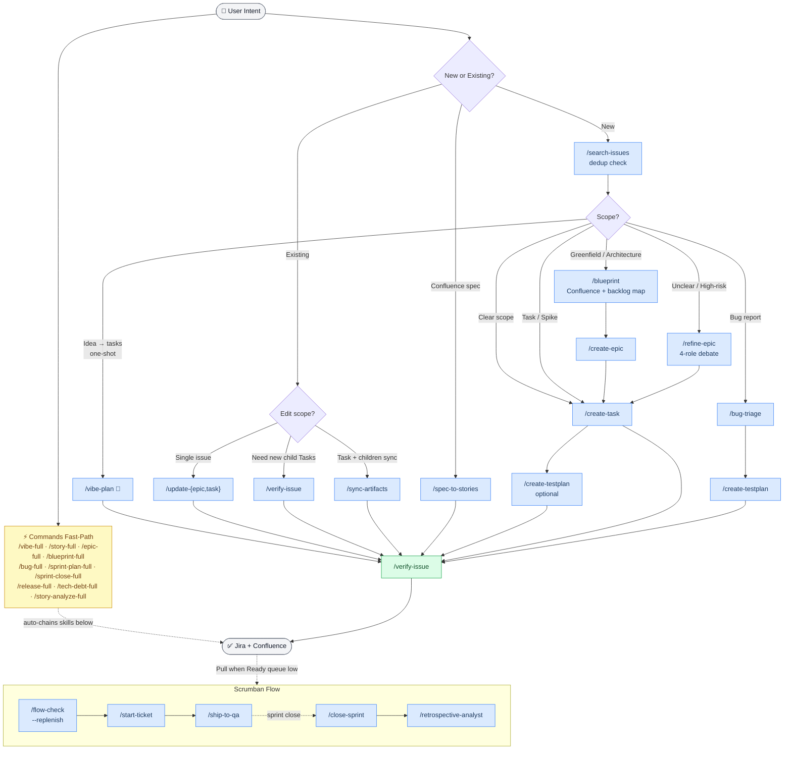

# atlassian-pm

> Claude Code plugin for AI-powered Jira & Confluence automation — create Epics, Tasks, and manage Scrumban flow using natural language.

[](https://github.com/wasikarn/atlassian-pm)
[](LICENSE)
[](https://claude.ai/claude-code)

---

## 💡 Idea & Concept

**Vibe Coding for Jira** — แปลง idea เป็น backlog ได้ใน 2 interactions โดยไม่ต้องเขียน Jira ticket เอง

```text
💡 "สร้าง feature push notification บนมือถือ"
   → /vibe-full → Epic + Tasks + AI-Ready child Tasks
   → พร้อม Implementation Hints (entry point, pattern, test command)
   → ทีมงานแค่ /implement {{PROJECT_KEY}}-123 ใน Claude Code
```

**Core Concepts:**

| Concept | สิ่งที่ทำ |
| --- | --- |
| **Vibe Mode** | Fast path: idea → backlog ใน 2 interactions (default สำหรับทุก creation skills) |
| **AI-Ready Tasks** | แต่ละ Task มี Implementation Hints — entry point file, pattern ที่ควรใช้, test command |
| **Quality Gate** | ADF ต้องผ่าน QG ≥ 90% ก่อน publish — ป้องกัน format พัง |
| **Hard Rules** | 10 rules ที่ hooks enforce อัตโนมัติ — ป้องกัน silent failures |
| **Token Cache** | SQLite cache ลด Jira API calls 80–90% — ประหยัด tokens |
| **Domain Expertise** | แต่ละ skill มี Scrum/SAFe/ITIL/DORA/IEEE 829 notes ฝังอยู่ |

**ใครควรใช้:**

- PM/PO ที่ต้องการแปลง idea → backlog ไว
- Engineer ที่ต้องการ Tasks พร้อม implementation hints
- QA ที่ต้องการ test plans จาก acceptance criteria
- Team ที่ใช้ Scrumban และต้องการ flow management

---

## Quick Start

```bash
/plugin marketplace add wasikarn/atlassian-pm
/plugin install atlassian-pm@atlassian-pm
/atlassian-pm:apm-setup
```

Claude will ask for your Jira site, project key, and board ID — then configure everything automatically.

> **After plugin updates:** re-run `/atlassian-pm:apm-setup` to rebuild the `atlassian-cache` venv. The MCP server starts automatically — setup just installs its Python dependencies.
> Requires Claude Code with plugin support. If `/plugin install` is unavailable, see [Manual Installation](#manual-installation).

---

## How It Works

```text
⚡ Commands:  /vibe-full → chains skills end-to-end with confirmation gates
🚀 Vibe mode: /atlassian-pm:apm-vibe-plan "feature desc" → Epic + Tasks + AI-Ready child Tasks
   Skills:   /atlassian-pm:apm-create-task → Explore codebase → Write ADF → QG ≥ 90% → Jira
```

1. **Describe** in natural language (Thai/English) or use a Command for full workflow
2. **Explore** — Claude finds real implementation paths in your codebase
3. **Quality Gate** — ADF scored ≥ 90% before publish (hooks enforce 10 hard rules)
4. **Publish** — `acli` creates issues, MCP handles field updates

### Workflow



---

## Commands

End-to-end orchestration chains — the fastest way to get things done. Each command chains multiple skills in sequence with confirmation gates between stages. Invoked as `/name` (no namespace prefix).

| Command | Chains | Description |
| --- | --- | --- |
| `/vibe-full` | search-issues → vibe-plan → verify-issue --with-subtasks | Idea → AI-Ready Tasks in one shot (vibe coding) |
| `/story-full` | search-issues → create-task → verify-issue --with-subtasks | Full Task creation with dedup + quality check |
| `/epic-full` | search-issues → create-epic → create-task → verify-issue --with-subtasks | Full Epic + Task creation end-to-end |
| `/blueprint-full` | blueprint → create-epic → create-task → verify-issue --with-subtasks | Greenfield feature from design to verified backlog |
| `/bug-full` | search-issues → bug-triage → create-testplan | Bug report with triage + test plan |
| `/qa-full` | create-testplan → execute-testplan | Create test plan + run against staging in one step |
| `/story-analyze-full` | verify-issue --with-subtasks | Verify existing Task + child alignment |
| `/sprint-close-full` | close-sprint → retrospective-analyst | Sprint closure + auto-generated retrospective |
| `/sprint-plan-full` | plan-sprint → map-dependencies | _(Release forecasting only — not Scrumban daily flow)_ Capacity-based sprint allocation |
| `/release-full` | plan-release → release-notes | Release plan + Confluence release notes |
| `/tech-debt-full` | scan-tech-debt → create-task (per item) | Scan and create tasks for selected tech-debt items |

---

## Skills

Individual steps invoked as `/atlassian-pm:<name>`. Use when you need finer control over a specific phase. Each skill is a multi-phase workflow with domain-expert notes (Scrum, SAFe, ITIL, DORA, IEEE 829) embedded alongside the steps. Grouped by primary user role — many skills are useful across roles.

### PM / Product Owner

Backlog ownership, flow management, documentation, and reporting.

| Skill | Flags | Description |
| --- | --- | --- |
| `/atlassian-pm:apm-blueprint` | | 5-role debate → Confluence blueprint + backlog map (S/M/L tiers) |
| `/atlassian-pm:apm-refine-epic` | | 4-role debate for unclear or high-risk requirements |
| `/atlassian-pm:apm-create-epic` | `--thorough` `--no-doc` | Epic + Confluence doc. Vibe default: auto-extract, skip RICE. `--no-doc` for Jira-only (skip Confluence). `--thorough` for full ceremony. |
| `/atlassian-pm:apm-vibe-plan` | `--dry-run` | 🚀 Idea → Epic + Stories + AI-Ready Subtasks in one shot (max 2 interactions). `--dry-run` to preview plan without creating in Jira. |
| `/atlassian-pm:apm-plan-release` | | Multi-sprint release plan + Confluence page + Jira Fix Version |
| `/atlassian-pm:apm-spec-to-stories 12345` | | Convert Confluence spec page → batch-create Tasks |
| `/atlassian-pm:apm-search-issues` | | Dedup check before creating |
| `/atlassian-pm:apm-assign-issue ABC-123 [name]` | | Assign issue (bypasses MCP silent failure) |
| `/atlassian-pm:apm-flow-check` | `--replenish` | Board health snapshot + Scrumban replenishment trigger |
| `/atlassian-pm:apm-close-sprint` | `--sprint 123` | Close sprint: triage incomplete → move → Confluence review |
| `/atlassian-pm:apm-standup-report` | `--post` | Daily standup digest per assignee with anomaly detection |
| `/atlassian-pm:apm-reschedule-sprint` | `--sprint 123 --shift +7` | Bulk-shift issue dates across a sprint or issue list |
| `/atlassian-pm:apm-activity-report` | `--hours 48` | Work activity report from session history |
| `/atlassian-pm:apm-create-doc` | | Create page: `tech-spec`, `adr`, `parent` |
| `/atlassian-pm:apm-update-doc` | | Update or move a Confluence page |
| `/atlassian-pm:apm-release-notes` | | Generate Confluence release notes from a Jira Fix Version |
| `/atlassian-pm:apm-plan-sprint` | `--sprint 123` `--carry-over-only` | _(Release forecasting only)_ Capacity-based sprint allocation |

### Engineer / Tech Lead

Story and task authoring, DLC flow, codebase exploration, issue maintenance, and quality gates.

| Skill | Flags | Description |
| --- | --- | --- |
| `/atlassian-pm:apm-start-ticket ABC-123` | `--force` | Read AC + transition to In Progress. WIP gate enforced. |
| `/atlassian-pm:apm-ship-to-qa ABC-123` | | Post PR + preview URLs to Jira + transition to Ready for QA. WIP gate enforced. |
| `/atlassian-pm:apm-create-task` | `--thorough` | Task with child Tasks. Vibe default: auto-extract + Implementation Hints. Auto-detects type (feature, bug, chore, spike). |
| `/atlassian-pm:apm-map-dependencies` | `--keys ABC-1,ABC-2` | Critical path + swim lane dependency analysis |
| `/atlassian-pm:apm-update-epic ABC-123` | | Edit Epic — scope, RICE, metrics |
| `/atlassian-pm:apm-update-task ABC-123` | | Edit Task — ACs, scope, description, format |
| `/atlassian-pm:apm-sync-artifacts ABC-123` | | Bidirectional sync: Task ↔ child Tasks ↔ Confluence |
| `/atlassian-pm:apm-verify-issue ABC-123` | `--with-subtasks` `--fix` `--dry-run` | ADF format + INVEST criteria check |
| `/atlassian-pm:apm-scan-tech-debt` | | Aggregate tech-debt/spike issues → Effort×Impact matrix on Confluence |

### QA / Tester

Test planning, bug intake, and acceptance verification.

| Skill | Flags | Description |
| --- | --- | --- |
| `/atlassian-pm:apm-create-testplan ABC-123` | | Test Plan + `[QA]` Tasks from parent ACs |
| `/atlassian-pm:apm-execute-testplan ABC-123` | | Run Google Sheet test cases via Playwright → write results back → create bug tickets |
| `/atlassian-pm:apm-bug-triage` | `--no-assign` | Full triage: intake → P1/P2/P3 severity → dedup check → assign. `--no-assign` to skip assignment gate. |

---

## Agents

Internal subagents dispatched automatically by skills and commands — not invoked directly. Organized in 3 layers by responsibility.

| Agent | Model | Role |
| --- | --- | --- |
| `code-explorer` | haiku | Codebase exploration; Memory-First Protocol |
| `issue-bootstrap` | haiku | Pre-fetch issue + parent + children context in one pass |
| `jira-search` | haiku | Duplicate detection with confidence scoring (EXACT/HIGH/MEDIUM/LOW) |
| `quality-gate` | sonnet | ADF quality scoring; Pattern Memory; Team Convention Check |
| `pr-description-writer` | haiku | Generate PR description from branch + issue |
| `pr-review-jira-sync` | haiku | Sync merged PR back to Jira (transition + comment) |
| `velocity-tracker` | haiku | Velocity history; anomaly detection (1.5σ); per-member stats |
| `sprint-transition-agent` | haiku | Batch sprint issue moves + sprint state transitions |
| `spec-parser-agent` | haiku | Parse Confluence spec → structured requirements (Read-only) |
| `story-writer` | sonnet | ADF JSON generation; Convention Memory; Service-Aware AC Defaults |
| `alignment-checker` | sonnet | AC Coverage Matrix; Predictive Risk Flags; Scope Drift detection |
| `backlog-groomer` | sonnet | WSJF scoring; aging alerts; Sprint-Ready/Blocked/Orphan grouping |
| `retrospective-analyst` | sonnet | Cross-Sprint Comparison; Team Health Score (0–100) |
| `sprint-planner` | sonnet | Risk-Adjusted Capacity; 3 Scenario Planning |
| `estimation-calibrator` | haiku | SP calibration from historical similarity; HIGH/MEDIUM/LOW confidence |
| `risk-forecaster` | sonnet | 4-dimension delivery risk; named mitigations; adjusted scenarios |
| `adf-surgeon` | haiku | Structural ADF repair; 10 known Jira quirks; content-safe |
| `team-pattern-advisor` | sonnet | Multi-sprint strategic patterns; ≥3 data point threshold |
| `test-case-runner` | sonnet | Execute single Playwright test case; return structured result + evidence |
| `bug-evidence-writer` | haiku | Generate ADF bug description from test failure evidence |

---

## Usage Examples

### Natural Language Prompts

Type these directly in Claude Code — no slash command needed. Claude detects intent and invokes the right skill automatically.

#### Feature Planning (vibe-plan)

```text
vibe plan "coupon redemption at checkout for logged-in users"

สร้าง feature ระบบ push notification บนมือถือ

แตก feature video upload พร้อม progress bar ออกเป็น tasks ให้หน่อยครับ

plan feature: social login with Google OAuth — affects website + backend API
```

Each generates: Epic + Tasks + AI-Ready child Tasks with Implementation Hints (entry point, pattern, test command). Max 2 interactions — one tree review, then auto-creates in Jira.

#### Issue Verification (verify-issue)

```text
verify {{PROJECT_KEY}}-123 --with-subtasks

ตรวจสอบ {{PROJECT_KEY}}-456 พร้อม child tasks ทั้งหมด

check alignment for {{PROJECT_KEY}}-789 --fix

technical quality check for {{PROJECT_KEY}}-321 — 3 services impacted: BE, Admin, Website
```

Checks ADF format, INVEST criteria, and alignment across the full issue tree. Use `--fix` to auto-repair issues found.

#### Task Creation

```text
สร้าง task: ผู้ใช้สามารถ reset password ผ่าน email ได้

create task for Google SSO login — users should be able to sign in without a password

สร้าง task สำหรับ feature แสดง transaction history ใน admin dashboard [FE-Admin]
```

#### Bug Report

```text
bug: ผู้ใช้ checkout ไม่ได้เมื่อ coupon code มีตัวอักษรพิเศษ

video player crash เมื่อ seek ไปที่ timestamp ที่ยังไม่ได้ buffer — P2

bug report: API returns 500 when user has more than 50 items in cart
```

#### Quality Check

```text
verify {{PROJECT_KEY}}-123 --with-subtasks --fix

ตรวจสอบ ticket {{PROJECT_KEY}}-456 พร้อม subtasks ทั้งหมด และ fix ที่มีปัญหา

check if {{PROJECT_KEY}}-789 subtasks are aligned — dry run only
```

---

### Slash Command Workflows

#### Full Feature (vibe path)

```bash
# Fastest: idea → AI-Ready subtasks in one shot
/vibe-full "real-time notification system for mobile users"
# → dedup check → Epic + Stories + subtasks → verified
```

#### Full Feature (thorough path)

```bash
# 1. Design (multi-role debate → Confluence + backlog map)
/atlassian-pm:apm-blueprint
→ "Build a real-time notification system"

# 2. Dedup check
/atlassian-pm:apm-search-issues

# 3. Epic + Confluence doc
/atlassian-pm:apm-create-epic

# 4. Task + child Tasks (explores codebase automatically)
/atlassian-pm:apm-create-task

# 5. QA child Tasks (optional)
/atlassian-pm:apm-create-testplan ABC-123

# 6. Verify the full tree
/atlassian-pm:apm-verify-issue ABC-123 --with-subtasks
```

#### Unclear Requirements

```text
# 4-role debate before writing Jira artifacts
/atlassian-pm:apm-refine-epic
→ Roles: PO × Tech Lead × Engineer × QA
→ Output: revised requirements + refined ACs → ready for /create-task
```

#### Scrumban Flow

```text
# Check board health + replenish Ready queue when low
/atlassian-pm:apm-flow-check

# Start a ticket (read AC + move to In Progress)
/atlassian-pm:apm-start-ticket {{PROJECT_KEY}}-123

# Ship to QA after PR is open (posts PR + preview URLs + transitions ticket)
/atlassian-pm:apm-ship-to-qa {{PROJECT_KEY}}-123
```

#### Update with Cascade

```bash
# Task only
/atlassian-pm:apm-update-task ABC-123

# Task + child Tasks + Confluence (all in sync)
/atlassian-pm:apm-sync-artifacts ABC-123
```

---

## Online Installation (Recommended)

Install without cloning the repo — Claude handles everything.

> **Before you begin** — have these ready:
>
> - Atlassian API token ([Account Settings → Security → API tokens](https://id.atlassian.net/manage-profile/security/api-tokens))
> - Jira site URL (e.g. `your-company.atlassian.net`)
> - Jira project key (e.g. `ABC`)
> - Board ID (optional — can look up after setup)
>
> Setup takes **2–3 minutes** (downloads acli, uv, and syncs the cache server venv).
> Claude Code must be **restarted once** after setup to activate the MCP server.

### Claude Desktop (GUI)

Open **Settings → Extensions → Add marketplace**, enter:

```text
wasikarn/atlassian-pm
```

Click **Sync** — Claude Desktop fetches the plugin catalog from GitHub. Then find `atlassian-pm` in the Extensions list and click **Install**.

Finally, open the Code tab and run setup:

```text
/atlassian-pm:apm-setup
```

### Claude Code (CLI)

**Step 1** — Add marketplace

```text
/plugin marketplace add wasikarn/atlassian-pm
```

**Step 2** — Install plugin

```text
/plugin install atlassian-pm@atlassian-pm
```

**Step 3** — Run setup

```text
/atlassian-pm:apm-setup
```

---

Claude will ask for your Jira site, project key, and board ID, then write the config and configure git filters automatically.

`/atlassian-pm:apm-setup` configures:

- ✓ acli (Jira CLI) — installed + authenticated
- ✓ mcp-atlassian — registered as user-scoped MCP server
- ✓ `~/.config/atlassian/.env` — Jira/Confluence credentials
- ✓ git smudge/clean filters — placeholder conversion
- ✓ atlassian-cache venv — Python deps for local issue cache (SQLite + embeddings)

The `atlassian-cache` MCP server registers automatically via the plugin's `.mcp.json` — no manual step needed. Restart Claude Code once after setup to activate it.

---

## Prerequisites

| Tool | Purpose | Install |
| --- | --- | --- |
| [Homebrew](https://brew.sh) | macOS package manager | `/bin/bash -c "$(curl -fsSL https://raw.githubusercontent.com/Homebrew/install/HEAD/install.sh)"` |
| [Claude Code](https://claude.ai/claude-code) | AI agent runtime | `npm i -g @anthropic-ai/claude-code` |
| [acli](https://bobswift.atlassian.net/wiki/spaces/ACLI/overview) | Jira ADF publishing | `brew tap atlassian/homebrew-acli && brew install acli` |
| [mcp-atlassian](https://github.com/sooperset/mcp-atlassian) | Jira/Confluence MCP | configured by setup (Phase 4) |
| Python 3.11+ | REST API scripts + cache server | `brew install python@3.11` |

> **uv** (Python package manager) is required for the cache server: `brew install uv`

---

## Manual Installation

<details>
<summary>Click to expand (8 steps)</summary>

```bash
# 1. Clone
git clone https://github.com/wasikarn/atlassian-pm && cd atlassian-pm

# 2. Create config
cp config/project-config.json.template .claude/project-config.json
# Edit .claude/project-config.json with your Jira site, project key, board ID

# 3. Authenticate acli
echo "<api-token>" | acli jira auth login --site https://your-site.atlassian.net --email your@email.com --token

# 4. Create credentials file
mkdir -p ~/.config/atlassian && chmod 700 ~/.config/atlassian
cat > ~/.config/atlassian/.env << 'EOF'
JIRA_URL=https://your-site.atlassian.net
JIRA_USERNAME=your@email.com
JIRA_API_TOKEN=<your-api-token>
CONFLUENCE_URL=https://your-site.atlassian.net/wiki
CONFLUENCE_USERNAME=your@email.com
CONFLUENCE_API_TOKEN=<your-api-token>
EOF
chmod 600 ~/.config/atlassian/.env

# 5. Configure MCP
claude mcp add --scope user mcp-atlassian -- \
  uvx --no-cache mcp-atlassian==0.21.0 \
  --env-file ~/.config/atlassian/.env \
  --jira-projects-filter=YOUR_PROJECT_KEY \
  --confluence-spaces-filter=YOUR_SPACE_KEY

# 6. Run setup
./scripts/setup.sh

# 7. Install cache server venv
UV_PROJECT_ENVIRONMENT="$HOME/.claude/plugins/data/atlassian-pm-atlassian-pm/venv" \
  uv sync --project mcp-servers/atlassian-cache --extra embeddings

# 8. Load plugin
claude --plugin-dir /path/to/atlassian-pm
# Or add to ~/.claude/settings.json: { "pluginDirs": ["/path/to/atlassian-pm"] }

# Verify
acli jira auth status
/atlassian-pm:apm-doctor
```

</details>

---

## Architecture

Coda-level performance via multi-tier state management:

- **L1 Cache**: Process-level LRU cache for zero-latency reads.
- **State-Daemon**: RAM-based state management via Unix Domain Sockets (Zero-Disk I/O).
- **SQLite WAL**: ACID-compliant persistent storage with Write-Ahead Logging, Bloom Filters, and Delta Tracking.
- **Iterative ADF Processing**: Stack-based traversal to prevent RecursionError in large documents.

---

## Configuration

All values in `.claude/project-config.json` (gitignored). Template: `config/project-config.json.template`

| File | Purpose |
| --- | --- |
| `.claude/project-config.json` | Jira fields, team roster, services, environments |

**Git Filter** — automatic placeholder conversion:

```text
Committed:    {{PROJECT_KEY}}-XXX   ← placeholders
Working tree: ABC-XXX   ← real values
Staged:       {{PROJECT_KEY}}-XXX   ← placeholders
```

| Placeholder | Replaces |
| --- | --- |
| `{{PROJECT_KEY}}` | Your Jira project key (e.g., `ABC`) |
| `{{JIRA_SITE}}` | Your Jira domain (e.g., `acme-corp.atlassian.net`) |

---

## Project Structure

```text
.claude-plugin/plugin.json       ← Plugin manifest
.mcp.json                        ← MCP server config
.claude/project-config.json      ← Real config (gitignored)

skills/                          ← 39 skills in 6 categories + 2 root-level
├── apm-setup/                   ← setup
├── apm-doctor/                  ← doctor
├── epic/                        ← blueprint, refine-epic, create-epic, vibe-plan, update-epic, plan-release
├── story/                       ← spec-to-stories, verify-issue, sync-artifacts
├── task/                        ← create-task, create-testplan, execute-testplan, bug-triage, start-ticket, ship-to-qa
├── sprint/                      ← flow-check, map-dependencies, close-sprint, standup-report, plan-sprint, retro-actions
├── confluence/                  ← create-doc, update-doc
└── utilities/                   ← search-issues, activity-report, scan-tech-debt, release-notes, status

references/                     ← Docs loaded on-demand (templates, hr-rules, troubleshooting)
scripts/                        ← Python scripts (ai/, api/, lib/, sprint/)
agents/                         ← 20 subagents (3-layer: Foundation, Analysis, Synthesis)
hooks/                          ← 68 Python hooks (HR1–HR10 enforcement, quality gates, cache)
.claude/commands/               ← 11 orchestration chains (vibe-full, story-full, epic-full, ...)
mcp-servers/atlassian-cache/    ← SQLite + FTS5 + embeddings cache
```

**Full structure:** See [skills/README.md](skills/README.md) for skill index, [hooks/README.md](hooks/README.md) for hooks reference.

---

## Tips

**Always search first** — run `/atlassian-pm:apm-search-issues` before creating anything to prevent duplicates.

**Always verify after** — run `/atlassian-pm:apm-verify-issue ABC-XXX --with-subtasks` to check ADF format, INVEST criteria, and alignment across the full tree.

**Save tokens** — run `cache_sprint_issues(sprint_id=...)` before flow-check or close-sprint to pre-cache all issues. Repeated reads cost 0 API tokens.

**Let Claude explore** — `/atlassian-pm:apm-create-task` always explores the codebase before creating child Tasks. Never skip — generic Tasks miss real implementation paths.

**Dev hot-reload** — after editing skill or agent files, use `/reload-plugins` in Claude Code.

**Plugin development** — `marketplace.json` must be in `.claude-plugin/` (not repo root). When skills are organized in category subdirectories, `skills` must be an array of paths (e.g., `["./skills/setup/", "./skills/story/"]`) — a single `"./skills/"` path will not discover nested categories.
