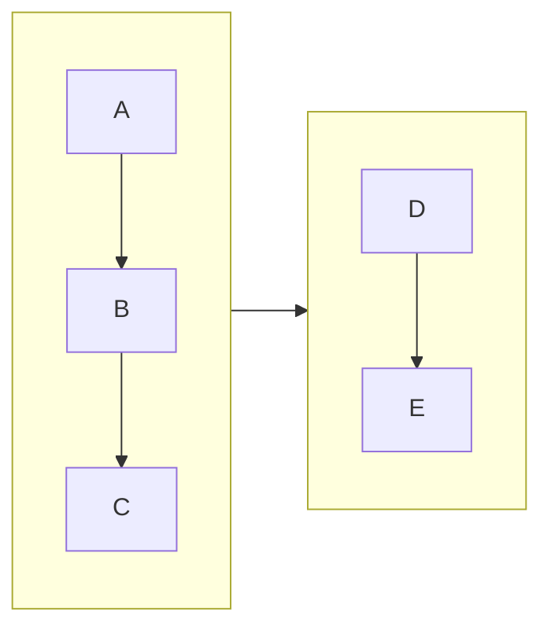
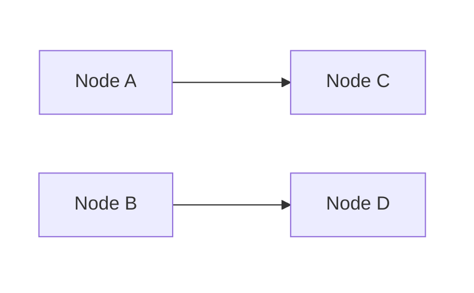
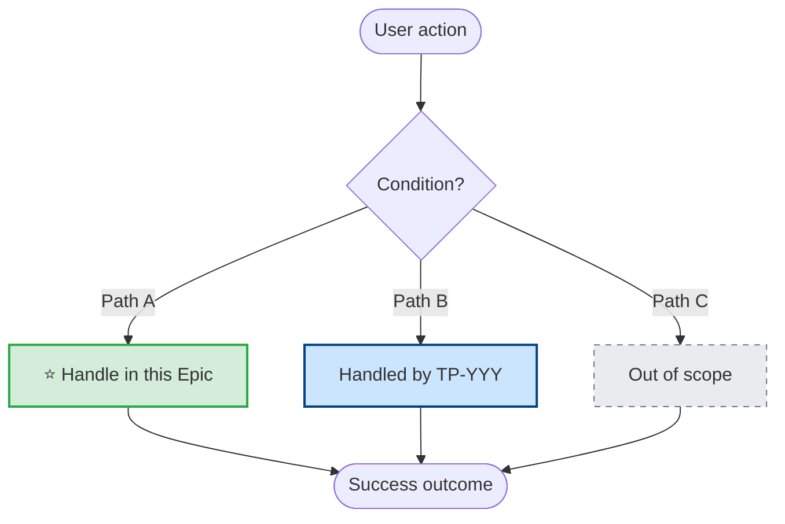
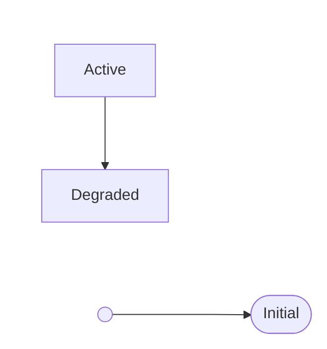
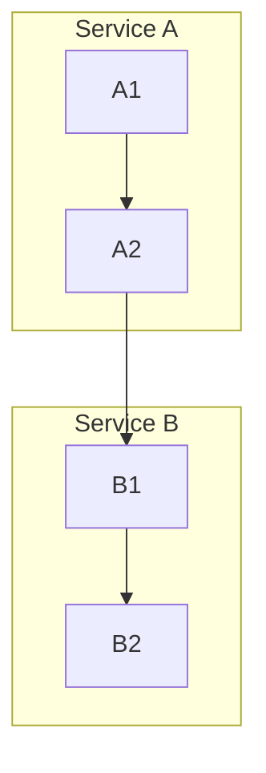

# Mermaid Diagram Guide

> Layout control, best practices, and Confluence-specific patterns

## Layout Engines

| Engine | Syntax | Best For | Notes |
| --- | --- | --- | --- |
| **dagre** (default) | No config needed | Simple (<10 nodes) | Default renderer |
| **elk** | `%%{init: {"layout": "elk"}}%%` | Complex, many edges | Requires `@mermaid-js/layout-elk` — likely unsupported on Confluence Forge |

**ELK options:**

| Option | Values | Effect |
| --- | --- | --- |
| `mergeEdges` | `true/false` | Combine parallel edges |
| `nodePlacementStrategy` | `LINEAR_SEGMENTS` / `BRANDES_KOEPF` | Node positioning |
| `cycleBreakingStrategy` | various | Handle graph cycles |
| `forceNodeModelOrder` | `true/false` | Respect declaration order |

## Direction Control

| Direction | Use When |
| --- | --- |
| `TD` (default) | Hierarchy/tree, sequence with fallback |
| `LR` | Linear pipeline, state machine with back-edges |
| `BT` / `RL` | Rarely needed |

### Subgraph Direction Override



## Edge Overlap Solutions

### Strategy 1: Change Direction

Switch `TD` → `LR` — back-edges go left (cleaner than upward).

### Strategy 2: Invisible Subgraphs for Column Layout



### Strategy 3: Invisible Links for Spacing

`A ~~~ B` forces side-by-side positioning without rendering a visible edge.

```mermaid
flowchart TD
    A --> B
    A --> C
    B ~~~ C   %% forces B and C side-by-side
    B --> D
    C --> D
```

### Strategy 4: Node Declaration Order

Declare nodes in desired visual order before edges — dagre uses declaration order for placement.

### Strategy 5: Simplify Back-Edge Labels

Short labels reduce curve width: `-->|"Reconnect"|` not `-->|"Reconnect and synchronize data"|`.

## Node Shapes

| Shape | Syntax | Use For |
| --- | --- | --- |
| Rectangle | `A[text]` | Standard state/process |
| Rounded | `A(text)` | Generic node |
| Stadium | `A([text])` | Transient/intermediate state |
| Circle | `A((text))` | Start/end point |
| Small circle | `A(( ))` | Initial state marker |
| Diamond | `A{text}` | Decision |
| Hexagon | `A{{text}}` | Condition/check |
| Database | `A[(text)]` | Data store |
| Asymmetric | `A>text]` | Signal/event |

## Link Types

| Type | Syntax | Use For |
| --- | --- | --- |
| Arrow | `A --> B` | Standard flow |
| Open | `A --- B` | Association |
| Dotted arrow | `A -.-> B` | Optional/conditional |
| Thick arrow | `A ==> B` | Critical path |
| Invisible | `A ~~~ B` | Layout control |
| Labeled | `A -->\|"text"\| B` | Labeled transition |

## Line Break in Labels

Use `<br/>` everywhere — `\n` renders as literal text on Confluence.

```mermaid
A["Line 1<br/>Line 2"]
```

## Edge Animation

> **Confirmed working** on Confluence Forge Mermaid plugin v11.12.2. Requires Mermaid 11.x+.

Assign IDs with `id@` prefix. `animate: true` = default speed, `animation: fast/slow` for speed, `classDef` for CSS control. Edges without IDs stay static.


> **Escape commas** in style values with `\,`.

### `&` Syntax Limitation

`D & E e1@--> F` assigns the ID to only **one** edge. Always split:

```mermaid
D e1@--> F
E e2@--> F
e1@{ animation: fast }
e2@{ animation: fast }
```

**Test script:** `scripts/confluence/test_mermaid_animation.py`

## Styling

`style NODE_ID fill:#color,stroke:#color,stroke-width:2px`

| State | Fill | Stroke |
| --- | --- | --- |
| Success / Online | `#d4edda` | `#28a745` |
| Warning / Degraded | `#fff3cd` | `#ffc107` |
| Error / Critical | `#f8d7da` | `#dc3545` |
| Highlight / New | `#ffd700` | `#333` |
| Info / Neutral | `#cce5ff` | `#004085` |

## Confluence-Specific Patterns

### Forge Plugin Requirements

Requires **two elements** (details: `troubleshooting.md` → "Mermaid Diagrams"):

1. **Code block** (`language=mermaid`) — diagram source
2. **Forge `ac:adf-extension` macro** — renderer

### Programmatic Creation

Reference: `scripts/confluence/create_player_architecture_page.py`

```python
# mermaid_diagram(code, page_id) — generates code block + Forge macro
# tracked_code_block() — non-mermaid code blocks (maintains index counter)
# _code_block_count — global counter, reset per page build
```

### Hiding Mermaid Source Code

**`collapse=true` does NOT work** on Mermaid code blocks. Use **Expand macro** — Forge renderer goes **outside** so diagram stays visible:

```xml
<ac:structured-macro ac:name="expand" ac:schema-version="1">
  <ac:parameter ac:name="title">Mermaid Source</ac:parameter>
  <ac:rich-text-body>
    <ac:structured-macro ac:name="code" ac:schema-version="1">
      <ac:parameter ac:name="language">mermaid</ac:parameter>
      <ac:plain-text-body><![CDATA[flowchart TD ...]]></ac:plain-text-body>
    </ac:structured-macro>
  </ac:rich-text-body>
</ac:structured-macro>
<!-- Forge ac:adf-extension here — OUTSIDE expand, always visible -->
```

Blocks inside Expand still count toward `guest-params > index`. `mermaid_diagram()` auto-wraps in Expand; non-mermaid blocks use `tracked_code_block()`.

> Full details: `troubleshooting.md` → "Expand/Collapse Mechanisms in Confluence"

### Known Limitations

| Feature | Status | Workaround |
| --- | --- | --- |
| `\n` in labels | May not work | Use `<br/>` |
| ELK layout engine | Likely unsupported | Use dagre + layout tricks |
| `%%{init: ...}%%` | Partial support | Test before relying on it |
| Large diagrams (>30 nodes) | May render slowly | Split into smaller diagrams |
| Interactive features (click) | Not supported | Static labels only |
| **Special chars** (`×` `±` `:`) | **ALL diagram types** | Cause Forge parse error — use ASCII; `()` `_` also fail in gantt task names |
| **Gantt diagrams** | **Works (v11.12.2)** | Avoid `()` `_` in task names |
| **Edge animation** | **Works (v11.12.2)** | `animate: true`, `animation: fast/slow`, classDef confirmed |
| Architecture diagrams | Untested | `architecture-beta` (v11.1.0+) |
| Packet diagrams | Untested | `packet` (v11.0.0+) |

## Epic User Flow — All Branches Rule (v3.12.0)

> **Context:** Epic User Flow Mermaid diagrams MUST show all decision branches, not only the happy path. Each branch is labeled by coverage.

| Label | Meaning | Style |
| --- | --- | --- |
| `⭐ {{PROJECT_KEY}}-XXX` | Covered by this Epic | `fill:#d4edda, stroke:#28a745` |
| `TP-YYY` | Covered by a related Epic | `fill:#cce5ff, stroke:#004085` |
| `(out of scope)` | Not covered anywhere in this release | `fill:#e9ecef, stroke:#6c757d, stroke-dasharray: 5 5` |

### Template — 3-way decision



**Rules:**

- Every `{decision}` diamond MUST have all outgoing branches rendered — no silent happy-path-only.
- Every terminal node MUST carry a coverage label (`⭐ {{PROJECT_KEY}}-XXX`, plain `TP-YYY`, or `(out of scope)`).
- If a branch is covered by multiple Epics, list them: `⭐ {{PROJECT_KEY}}-XXX + TP-YYY`.
- Link labels (`-->|"label"|`) MAY be used for the transition condition, but the terminal node is the source of truth for coverage.

**Anti-pattern (from {{PROJECT_KEY}}-182):** diagram shows only AI-review path, QA-review path omitted — reader cannot tell if QA-review is out of scope or just forgotten.

## Common Patterns

### State Machine



### Architecture Overview



Use `sequenceDiagram` for request/response patterns instead of flowchart.

## Anti-Patterns

| Anti-Pattern | Problem | Fix |
| --- | --- | --- |
| Too many nodes | Unreadable, slow | Split into 2-3 diagrams |
| Long edge labels | Wide curves, overlap | Short labels; detail in text |
| `TD` + many back-edges | Upward curves cross | Switch to `LR` |
| Nodes in wrong subgraph | U-turn cross-edges | Move to boundary subgraph |
| `\n` line breaks | Literal text on Confluence | Use `<br/>` |
| `~~~` everywhere | Fragile layout | Subgraphs first |
| `&` with edge ID | Only one edge gets ID | Split to separate edges |

## Jira ASCII (default for all Jira issue types)

Jira ADF does not render SVG inline and Forge Mermaid macro is Confluence-only. Default Jira diagram format = **ASCII code block** (monospace, zero-dependency, diff-friendly).

**Render:** `/atlassian-pm:apm-pretty-mermaid` with `--format ascii --use-ascii`

```bash
node skills/utilities/apm-pretty-mermaid/scripts/render.mjs \
  --input /tmp/x.mmd --format ascii --use-ascii
```

**Embed in ADF:**

```json
{ "type": "codeBlock", "attrs": { "language": "text" },
  "content": [{ "type": "text", "text": "<ASCII output>" }] }
```

**Rules:**

- Width ≤ 80 cols (iPhone 14 Pro landscape width in Jira mobile).
- If exceeds: simplify, split into 2 diagrams (zoom-out + zoom-in), or move to Confluence SVG + Smart Link from Jira.
- `--use-ascii` forces pure `+-|` chars (some Jira fonts render Unicode box chars poorly).
- Gantt not supported in ASCII — use SVG on Confluence.

### ⚠️ Multi-branch decision flowchart — KNOWN BUG

`beautiful-mermaid` ASCII renderer has an unpatched upstream bug ([mermaid-ascii#56](https://github.com/AlexanderGrooff/mermaid-ascii/issues/56)) that mashes edge labels when a decision node has 3+ outgoing edges (example: `Branch-C:auncertainw/crequires-reviewhigh`). Does NOT affect `sequenceDiagram`, `stateDiagram-v2`, `erDiagram`, `classDiagram`, or 2-branch flowcharts.

**Default for 3+ branch decisions in Jira = `sequenceDiagram`** with `alt / else` blocks (typical width 85–100 cols, labels clean, Thai-safe).

Alternatives: `graph-easy` (Perl, DOT input) renders labels correctly but width 150–200 cols for 3-branch; ultra-short labels (≤ 4 chars) + legend table fits ≤ 80 cols but sacrifices readability.

Full workaround matrix + empirical widths: `skills/utilities/apm-pretty-mermaid/SKILL.md` → Known Issues.

## Related

- `/atlassian-pm:apm-pretty-mermaid` — ASCII / SVG rendering skill
- `troubleshooting.md` → "Mermaid Diagrams", "Expand/Collapse Mechanisms in Confluence", Instance IDs table
- `scripts/confluence/create_player_architecture_page.py` — reference implementation
