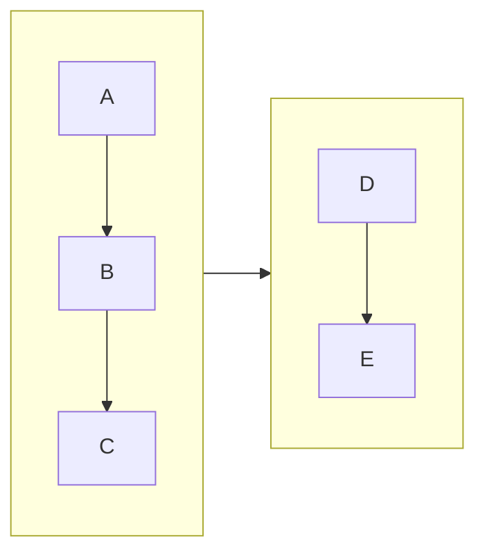
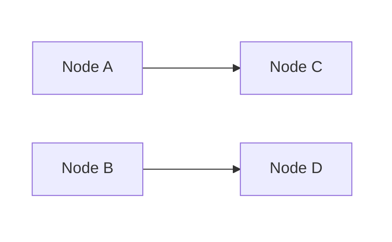
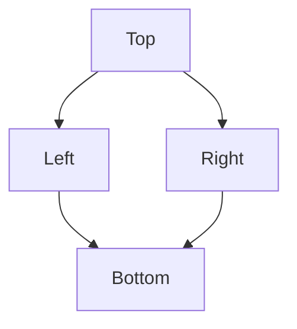
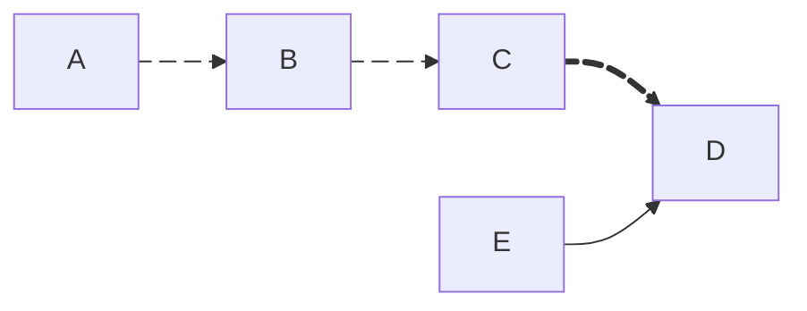
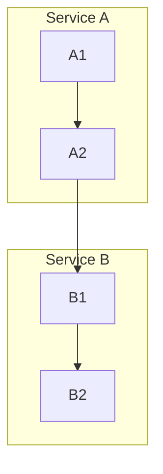

# Mermaid Diagram Guide

> Layout control, best practices, and Confluence-specific patterns

## Layout Engines

| Engine | Syntax | Best For | Notes |
| --- | --- | --- | --- |
| **dagre** (default) | No config needed | Simple diagrams (<10 nodes) | Default renderer, good for linear flows |
| **elk** | `%%{init: {"layout": "elk"}}%%` | Complex diagrams with many edges | Requires `@mermaid-js/layout-elk` — may not be available in all providers (e.g., Confluence Forge) |

**ELK options** (via init or YAML frontmatter):

| Option | Values | Effect |
| --- | --- | --- |
| `mergeEdges` | `true` / `false` | Combine parallel edges between same nodes |
| `nodePlacementStrategy` | `LINEAR_SEGMENTS` / `BRANDES_KOEPF` | Node positioning algorithm |
| `cycleBreakingStrategy` | various | How to handle cycles |
| `forceNodeModelOrder` | `true` / `false` | Respect declaration order for positioning |

## Direction Control

```mermaid
flowchart TD   %% Top-Down (default)
flowchart LR   %% Left-Right
flowchart BT   %% Bottom-Top
flowchart RL   %% Right-Left
```

| Pattern | Direction | Why |
| --- | --- | --- |
| Linear pipeline | `LR` | Reads like a timeline |
| Hierarchy / tree | `TD` | Parent-child intuitive top-down |
| State machine with back-edges | `LR` | Back-edges go left (cleaner than upward in TD) |
| Sequence with fallback | `TD` | Happy path down, error branches sideways |

### Subgraph Direction Override



## Edge Overlap Solutions

### Strategy 1: Change Direction

Switch `TD` → `LR` when back-edges cause overlap — left-going curves are cleaner than upward ones.

### Strategy 2: Invisible Subgraphs for Column Layout

Group nodes into invisible subgraphs to force column positioning:



### Strategy 3: Invisible Links for Spacing

`~~~` creates invisible connections that influence positioning:

```mermaid
flowchart TD
    A --> B
    A --> C
    B ~~~ C   %% invisible link forces B and C side-by-side
    B --> D
    C --> D
```

### Strategy 4: Node Declaration Order

Declare nodes in desired visual order before defining edges:



### Strategy 5: Simplify Back-Edge Labels

Shorter labels reduce visual clutter — `OFFLINE -->|"Reconnect"| ONLINE` not `|"Reconnect and synchronize data"|`.

## Line Break in Node Labels

| Syntax | Support |
| --- | --- |
| `<br/>` | All renderers (recommended) |
| `\n` | Some renderers only |

**Always use `<br/>` for Confluence** — `\n` may render as literal text.

```mermaid
A["Line 1<br/>Line 2"]   %% Good
A["Line 1\nLine 2"]      %% Bad — may not work in Confluence
```

## Node Shapes

| Shape | Syntax | Use For |
| --- | --- | --- |
| Rectangle | `A[text]` | Standard state/process |
| Rounded | `A(text)` | Generic node |
| Stadium | `A([text])` | Transient/intermediate state |
| Circle | `A((text))` | Start/end point |
| Small circle | `A(( ))` | Initial state marker |
| Diamond | `A{text}` | Decision |
| Hexagon | `A{{text}}` | Condition/check |
| Database | `A[(text)]` | Data store |
| Asymmetric | `A>text]` | Signal/event |

## Link Types

| Type | Syntax | Use For |
| --- | --- | --- |
| Arrow | `A --> B` | Standard flow |
| Open | `A --- B` | Association (no direction) |
| Dotted arrow | `A -.-> B` | Optional/conditional |
| Thick arrow | `A ==> B` | Emphasis/critical path |
| Invisible | `A ~~~ B` | Layout control only |
| With label | `A -->\|"text"\| B` | Labeled transition |

## Edge Animation

> **Confirmed working** on Confluence Forge Mermaid plugin v11.12.2 (tested Feb 21, 2026). Requires Mermaid 11.x+.

Assign edge IDs with `id@` prefix. Use `animate: true` for default, `animation: fast/slow` for speed, or `classDef` for full CSS control.



> **Escape commas:** Use `\,` in style values. Edges without IDs (e.g., `E --> D`) remain static.

### `&` Syntax Limitation

`D & E e1@--> F` assigns the edge ID to only **one** edge. Always split:

```mermaid
%% Good — both animate
D e1@--> F
E e2@--> F
e1@{ animation: fast }
e2@{ animation: fast }
```

| Pattern | When to Animate |
| --- | --- |
| Data flow | Show direction of data movement (Pusher events, API calls) |
| Critical path | Highlight the hot path |
| Real-time events | Indicate live/streaming connections |
| Before/After | Animate "new" edges, keep "old" static |

**Test script:** `scripts/confluence/test_mermaid_animation.py`

## Styling

```mermaid
style NODE_ID fill:#color,stroke:#color,stroke-width:2px
```

### Semantic Color Palette

| State | Fill | Stroke |
| --- | --- | --- |
| Success / Online | `#d4edda` | `#28a745` |
| Warning / Degraded | `#fff3cd` | `#ffc107` |
| Error / Critical | `#f8d7da` | `#dc3545` |
| Highlight / New | `#ffd700` | `#333` |
| Info / Neutral | `#cce5ff` | `#004085` |

## Confluence-Specific Patterns

### Mermaid on Confluence (Forge Plugin)

Requires **two elements** (see `troubleshooting.md` → "Mermaid Diagrams"):

1. **Code block** (`language=mermaid`) — diagram source
2. **Forge `ac:adf-extension` macro** — renderer

### Programmatic Creation

Reference: `scripts/confluence/create_player_architecture_page.py`

```python
# mermaid_diagram(code, page_id) — generates code block + Forge macro
# tracked_code_block() — non-mermaid code blocks (maintains index counter)
# _code_block_count — global counter, reset per page build
```

### Hiding Mermaid Source Code

**`collapse=true` does NOT work on Mermaid code blocks** — use the **Expand macro** instead. Forge renderer stays **outside** the Expand macro so diagram is always visible:

```xml
<ac:structured-macro ac:name="expand" ac:schema-version="1">
  <ac:parameter ac:name="title">Mermaid Source</ac:parameter>
  <ac:rich-text-body>
    <ac:structured-macro ac:name="code" ac:schema-version="1">
      <ac:parameter ac:name="language">mermaid</ac:parameter>
      <ac:plain-text-body><![CDATA[flowchart TD ...]]></ac:plain-text-body>
    </ac:structured-macro>
  </ac:rich-text-body>
</ac:structured-macro>
<!-- Forge ac:adf-extension here — OUTSIDE expand, always visible -->
```

- Code blocks inside Expand macros are still counted by `guest-params > index`.
- `mermaid_diagram()` automatically wraps code block in Expand macro. TypeScript/JSON blocks use `collapse=True` via `tracked_code_block()`.

> Full details: `troubleshooting.md` → "Expand/Collapse Mechanisms in Confluence"

### Known Limitations on Confluence

| Feature | Status | Workaround |
| --- | --- | --- |
| `\n` in labels | May not work | Use `<br/>` instead |
| ELK layout engine | Likely unsupported | Use dagre with layout tricks |
| `%%{init: ...}%%` | Partial support | Test before relying on advanced config |
| Large diagrams (>30 nodes) | May render slowly | Split into multiple smaller diagrams |
| Interactive features (click) | Not supported | Use static labels with links in surrounding text |
| **Special chars in labels** | **ALL diagram types** | `×` `±` `:` cause Forge parse error — use ASCII; `()` `_` also fail in gantt task names |
| **Gantt diagrams** | **Works (v11.12.2)** | Avoid `()` `_` in task names |
| **Edge animation** | **Works (v11.12.2)** | `e1@{ animate: true }`, `animation: fast/slow`, classDef CSS confirmed |
| Architecture diagrams | Untested | `architecture-beta` (v11.1.0+) — test before using |
| Packet diagrams | Untested | `packet` (v11.0.0+) — test before using |

## Common Diagram Patterns

### State Machine


### Architecture Overview



### Sequence-like Flow

Use `sequenceDiagram` instead of flowchart for request/response patterns.

## Anti-Patterns

| Anti-Pattern | Problem | Fix |
| --- | --- | --- |
| Too many nodes in one diagram | Unreadable, slow render | Split into 2-3 focused diagrams |
| Long labels on edges | Edges become wide, overlap | Short labels; detail in surrounding text |
| `TD` with many back-edges | Upward curves cross everything | Switch to `LR` |
| Nodes inside wrong subgraph | Cross-subgraph edges create U-turns | Move shared nodes to boundary subgraph |
| `\n` for line breaks | May render as literal text | Always use `<br/>` |
| Hardcoded layout with `~~~` everywhere | Fragile, breaks on content change | Use subgraphs for structural grouping first |
| `&` syntax with edge ID (`D & E e1@--> F`) | Only one edge gets the ID | Split: `D e1@--> F` + `E e2@--> F` |

## Related

- Confluence Mermaid rendering: [troubleshooting.md](troubleshooting.md) → "Mermaid Diagrams" section
- Reference implementation: `scripts/confluence/create_player_architecture_page.py`
- Forge macro details: `troubleshooting.md` → Instance IDs table
