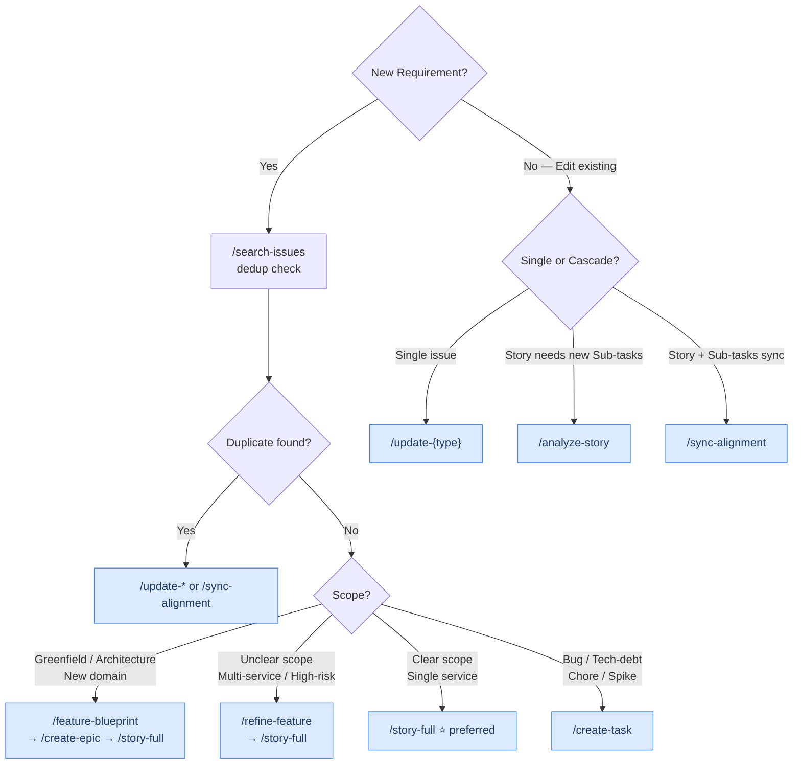
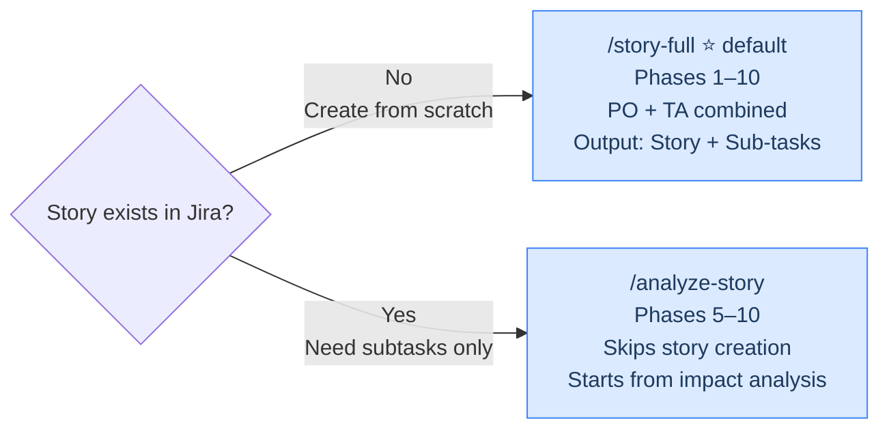

# Skill Orchestration

> Intent-to-skill mapping, quality gates, and decision trees.
> Read this before creating/editing Jira issues.

## Intent-to-Skill Map

| Intent | Skill Chain | Gate |
| --- | --- | --- |
| Feature blueprint | `/feature-blueprint` → `/create-epic` → `/story-full` → verify | ≥ 90% (Confluence) |
| Refine feature | `/search-issues` → `/refine-feature` → `/story-full` → verify | N/A (pre-creation) |
| Create epic | `/search-issues` → `/create-epic` → verify | ≥ 90% |
| Create story | `/search-issues` → `/story-full` → verify | ≥ 90% |
| Create task | `/search-issues` → `/create-task` → verify | ≥ 90% |
| Analyze story | `/analyze-story` → verify `--with-subtasks` | ≥ 90% |
| Test plan | `/create-testplan` → verify | ≥ 90% |
| Update single | `/update-{epic,story,task,subtask}` → verify | ≥ 90% |
| Update cascade | `/sync-alignment` → verify `--with-subtasks` | ≥ 90% |
| Plan sprint | `/plan-sprint` → `/dependency-chain` | N/A |
| Close sprint | `/sprint-closer` → `/retrospective-analyst` | N/A |
| Daily standup | `/standup-digest` | N/A |
| Release planning | `/release-planner` → `/plan-sprint` | N/A |
| Bulk reschedule | `/bulk-reschedule` | N/A |
| Import spec | `/spec-to-stories` → `/story-full` (per story) | ≥ 90% |
| Tech debt audit | `/tech-debt-radar` → `/create-task` (prioritized) | N/A |
| Bug triage | `/search-issues` → `/bug-triage` → `/create-testplan` (after fix) | ≥ 90% |
| Release notes | `/release-planner` → `/sprint-closer` → `/create-release-notes` | N/A |

**Rules:**

- Always `/search-issues` before creating (dedup)
- Always `/verify-issue` after creating/editing
- Use `/story-full` for new stories (combines PO + TA). Use `/analyze-story` only for existing stories needing subtasks

## HARD RULES

> Full definitions, examples, enforcement: [hr-rules.md](hr-rules.md)
> Hooks enforce HR2-HR7, HR10 automatically — violations are blocked.

| HR | Rule (one-liner) |
|----|-----------------|
| HR1 | QG ≥ 90% before any Atlassian write |
| HR2 | No ORDER BY with `parent =` / `parent in` in JQL |
| HR3 | Assignee via `acli` only — MCP silently fails |
| HR4 | Confluence macros via `update_page_storage.py` only |
| HR5 | Subtask = Two-Step (MCP create → verify parent → acli edit) |
| HR6 | `cache_invalidate(key)` after every MCP write |
| HR7 | Sprint ID always via `jira_get_sprints_from_board()` — never hardcode |
| HR8 | Subtask dates within parent range; SP sum ≈ parent |
| HR9 | Story ACs covered by subtask objectives; run `/verify-issue --with-subtasks` |
| HR10 | Never set sprint field on subtasks — inherited from parent |

### QG Scoring Reference

| Score | Status | Action |
| --- | --- | --- |
| 90-100% | Pass | Send to Atlassian |
| 70-89% | Warning | Auto-fix, then re-score |
| < 70% | Fail | Must fix, ask user if stuck |

| Check | Max | Applies To |
| --- | --- | --- |
| T1-T5 Technical | 5 | All types |
| S1-S5 Story Quality | 6 | Story |
| ST1-ST5 Subtask Quality | 5 | Sub-task |
| QA1-QA5 QA Quality | 5 | QA Sub-task |
| B1-B8 Blueprint Quality | 8 (or 5 for S-tier) | Blueprint (Confluence) |
| E1-E4 Epic Quality | 4 | Epic |
| A1-A6 Alignment | 6 | `--with-subtasks` only |

Full checklist: [verification-checklist.md](verification-checklist.md)

## Decision Trees

### Create or Update?



### story-full vs analyze-story?



## Pre/Post Conditions

| Skill | Pre-condition | Post-condition |
| --- | --- | --- |
| `/feature-blueprint` | Feature idea / concept | Confluence page + backlog map → `/create-epic` → `/story-full` |
| `/refine-feature` | `/search-issues` | Refined stories → `/story-full` |
| `/create-epic` | `/search-issues` | `/verify-issue` >= 90% |
| `/story-full` | `/search-issues` | `/verify-issue --with-subtasks` >= 90% |
| `/analyze-story` | Story exists | `/verify-issue --with-subtasks` >= 90% |
| `/create-testplan` | Story exists | `/verify-issue` >= 90% |
| `/create-task` | `/search-issues` | `/verify-issue` >= 90% |
| `/update-{type}` | Issue exists | `/verify-issue` >= 90% |
| `/sync-alignment` | Story/artifacts changed | `/verify-issue --with-subtasks` >= 90% |
| `/plan-sprint` | Sprint exists | — |
| `/dependency-chain` | Sprint planned | — |
| `/sprint-closer` | Active sprint with issues | Closed sprint + Confluence review page |
| `/standup-digest` | Active sprint | Digest output (optional Confluence post) |
| `/release-planner` | Epics with SP estimates | Confluence release plan + Jira Fix Version |
| `/bulk-reschedule` | Issues with dates | Updated dates + HR8 alignment |
| `/spec-to-stories` | Confluence page + epic | Jira User Stories linked to epic |
| `/tech-debt-radar` | Project with tech-debt issues | Confluence priority matrix page |

## Repomix Context Packs

> Load shared-references as a single Repomix pack instead of 4-5 individual Read calls.
> Packs defined in `shared-references/context-packs.json`.

### Usage

```text
1. Determine workflow type (story, subtask, sprint, verify, etc.)
2. Look up pack in context-packs.json → get file list
3. Call mcp__repomix__pack_codebase with includePatterns from pack
4. Use read_repomix_output or grep_repomix_output for targeted lookups
```

### Example: story workflow

```text
mcp__repomix__pack_codebase(
  directory: ".claude/skills/shared-references",
  includePatterns: "templates.md,verification-checklist.md,vertical-slice-guide.md,writing-style.md",
  compress: true
)
→ Single packed output replaces 4 Read calls
→ Tree-sitter compression reduces tokens ~40-60%
```

### When to Use Repomix vs Direct Read

| Situation | Use |
| --- | --- |
| Need 3+ shared-references files | Repomix pack |
| Need 1-2 specific files | Direct Read |
| Need to search across files | `grep_repomix_output` |
| Exploring target project codebase | Task(Explore) — Repomix insufficient |

### Pack Types

| Pack | Files | Use Case |
| --- | --- | --- |
| `story` | templates, verification, vertical-slice, writing-style | Create/update stories |
| `subtask` | templates, verification, tools, vertical-slice | Analyze story → subtasks |
| `epic` | templates, verification, writing-style | Create/update epics |
| `sprint` | sprint-frameworks, team-capacity, dependency, tools | Sprint planning |
| `verify` | jql-quick-ref, verification, templates, writing-style | Verify issue quality |
| `sync` | templates, verification, tools, orchestration | Cascade/sync alignment |

## Cache Hygiene

- After any MCP write (`jira_update_issue`, `jira_create_issue`) → `cache_invalidate(issue_key)`
- After sprint manipulation → `cache_invalidate(sprint_id)`
- Before sprint planning → `cache_refresh(sprint_id)` for fresh data
