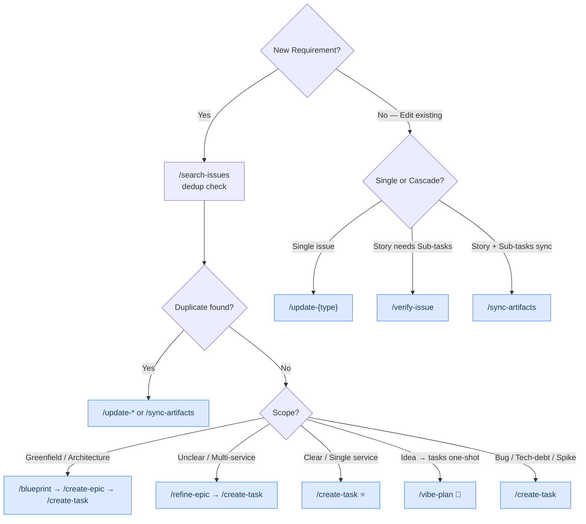

# Skill Orchestration

> Intent-to-skill mapping, quality gates, decision trees. Read before creating/editing Jira issues.

## Intent-to-Skill Map

| Intent | Skill Chain | Gate | Pre | Post |
|---|---|---|---|---|
| Feature blueprint | `/blueprint`→`/create-epic`→`/create-task`→verify | ≥90% | Feature idea | Confluence page |
| Refine feature | `/search-issues`→`/refine-epic`→`/create-task`→verify | — | search | Refined stories |
| Create epic | `/search-issues`→`/create-epic`→verify | ≥90% | search | verify ≥90% |
| Create story | `/search-issues`→`/create-task`→verify | ≥90% | search | verify `--with-subtasks` |
| Create task | `/search-issues`→`/create-task`→verify | ≥90% | search | verify ≥90% |
| Analyze story | `/verify-issue`→verify `--with-subtasks` | ≥90% | Story exists | verify `--with-subtasks` |
| Test plan | `/create-testplan`→verify | ≥90% | Story exists | verify ≥90% |
| Vibe: idea→tasks | `/vibe-plan`→verify `--with-subtasks` | ≥90% | Feature desc/epic | verify `--with-subtasks` |
| Update single | `/update-{epic,story,task,subtask}`→verify | ≥90% | Issue exists | verify ≥90% |
| Update cascade | `/sync-artifacts`→verify `--with-subtasks` | ≥90% | Artifacts changed | verify `--with-subtasks` |
| Import spec | `/spec-to-stories`→`/create-task` | ≥90% | Confluence+epic | Stories linked to epic |
| Bug triage | `/search-issues`→`/bug-triage`→`/create-testplan` | ≥90% | | |
| Replenishment | `/flow-check --replenish` | | project-config.json | WIP table |
| Dependencies | `/map-dependencies` | | Issues w/ links | Graph + critical path |
| Epic health | `/epic-health` | | Epic key | Coverage/SP/timeline |
| Daily ops | `/daily-ops` (standup→flow-check→blockers) | | Active sprint | Digest |
| Close sprint | `/close-sprint`→`/retrospective-analyst` | | Active sprint | Closed + Confluence |
| Close+actions | `/sprint-close-full-with-actions` | | Active sprint | Closed + retro tasks |
| Retro actions | `/retro-actions` | | Action-items block | Jira tasks + sprint |
| Release | `/plan-release`→`/release-notes` | | Epics w/ SP | Confluence + Fix Version |
| Reschedule | `/reschedule-sprint` | | Issues w/ dates | Updated + HR8 |
| Tech debt | `/scan-tech-debt`→`/create-task` | | | Confluence matrix |
| Start ticket | `/start-ticket` | | Issue in Jira | In Progress + AC |
| Ship to QA | `/ship-to-qa` | | PR open | Comment + Ready for QA |

**Rules:** Search before creating · Verify after every write · `/create-task` for new (PO+TA combined); `/verify-issue` for existing (subtasks only) · All creation = **vibe mode**; `--thorough` for full workflow

## QG Scoring

Threshold: ≥90% pass · 70-89% auto-fix · <70% fail

Checks: T1-T5 (all) · S1-S6 (story) · ST1-ST5 (subtask) · QA1-QA5 (QA subtask) · B1-B8/5 (blueprint) · E1-E4 (epic) · A1-A6 (`--with-subtasks`)

Checklist: [verification-checklist.md](verification-checklist.md) · HR rules: [hr-rules.md](hr-rules.md)

## Decision Trees

### Create or Update?

### create-task vs verify-issue?

Task doesn't exist → `/create-task` (creates new Task with type templates)
Task exists, need quality check → `/verify-issue` (verifies ADF format, INVEST, alignment)

## Context Packs

Pack definitions: `references/context-packs.json`. Read all pack files in one parallel message.

Packs: `story` (create/update) · `subtask` (analyze→subtasks) · `epic` · `sprint` · `verify` · `sync`

3+ files → pack · 1-2 → Direct Read · search → `grep_repomix_output` · codebase → Task(Explore)

## Cache Hygiene

MCP write → `cache_invalidate(issue_key)` · Sprint change → `cache_invalidate(sprint_id)` · Before flow-check/map-dependencies → `cache_refresh(sprint_id)`
