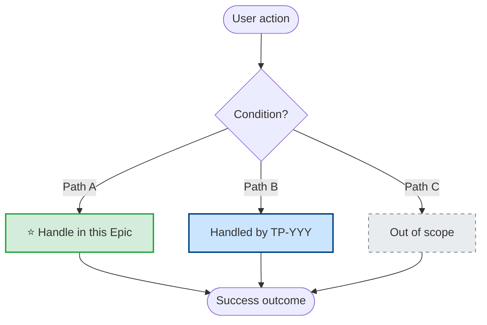

# Epic Template (ADF)

> **Prerequisite:** Read [templates-core.md](templates-core.md) for CREATE/EDIT rules, styling

## Epic Best Practices

**Naming:** `[Domain] — [Deliverable]` (never "Phase 1", "v2") · **Size:** 8-15 tasks, 2-6 months — split if >15 tickets, multiple domains, or mixed concerns.

> **Narrative tone:** สรุปภาพรวม และ คุณค่าทางธุรกิจ ต้องเขียนให้ PM, designer, หรือ stakeholder ที่ไม่ใช่ developer อ่านเข้าใจได้ทันที — ห้ามใช้ system term, acronym, หรือ tech jargon ใน 2 section นี้

## Ambiguous Title Cue Words

> **Pre-draft check:** ก่อนเริ่มเขียน Epic ให้ scan title หา cue words เหล่านี้. ถ้ามี **2 คำขึ้นไป** หรือคำที่มีหลายความหมายใน context ของ codebase — **REQUIRED:** ใส่ section `Scope Disambiguation` ก่อน `User Flow`.

```text
request · process · handle · manage · review · check · trigger · send · notify · update
```

**Example — ambiguous:** `"Review flow — notification trigger"` มี `review`, `trigger` → ต้องใส่ Scope Disambiguation เพื่อชี้ว่า `review` หมายถึง AI-review, manual-review, หรือ QA-review

**Example — unambiguous:** `"Billboard owner dashboard — export CSV"` → cue word ไม่มี, ข้าม Scope Disambiguation ได้

## Epic Template (ADF) - CREATE

> Used with `acli jira workitem create --from-json`
>
> **Content Budget** → see [writing-style.md](writing-style.md#content-budget-per-section)

**All 7 business sections are required. Scope Disambiguation is REQUIRED when title contains ambiguous cue words. Technical Reference section is optional (include when Epic has heavy technical detail).**

### Business Zone (ทีมทุกคนอ่าน — QA, PM, Stakeholder)

> **Language rule:** ห้าม class name, file path, method signature, code pattern (เช่น `whereIn` / `findBy`), i18n key, SQL query ใน Business Zone — ทุกอย่างต้องเขียนเป็น user-observable behavior. รายละเอียด technical ไปใส่ใน Technical Reference Zone.

1. **สรุปภาพรวม** — **3 lines max** (Problem → Solution → ใครได้ประโยชน์); ใช้ persona names (billboard owner, advertiser) ห้ามใช้ technical terms
2. **Scope Disambiguation** *(REQUIRED when title has ambiguous cue words)* — single explicit interpretation + rejected alternatives; see template below
3. **User Flow — ภาพรวมการทำงาน** — step-by-step scenario ภาษา business; ใช้ `orderedList` + `panel` (info/success/warning/note) + Mermaid flow diagram (`codeBlock` with `language: "mermaid"`) — **MUST show all decision branches** (see P7 rule below)
4. **คุณค่าทางธุรกิจ** — **3 bullets max**; ผลลัพธ์เป็นตัวเลข/พฤติกรรม ไม่ใช่ architecture
5. **ลูกค้าเห็นอะไร?** — UX perspective; include Before vs After table + example notification copy (TH/EN titles เท่านั้น — i18n keys ไปที่ Technical Reference)
6. **ขอบเขตงาน** — Included / Excluded bullets, **1 line/item**; user-observable features ("เพิ่มการแจ้งเตือน") ไม่ใช่ "สร้าง `AiFooNotifiable` class"; wrap key scope boundary in `panel` (info)
7. **เงื่อนไขที่ต้องผ่าน** — Epic-level ACs เขียนเป็น observable outcome ("เจ้าของป้ายเห็น notification") ไม่ใช่ implementation detail ("ใช้ `whereIn` pattern")
8. **ความเสี่ยงและวิธีรับมือ** — business impact language ("ป้ายหลายเจ้าของ อาจมีบางคนไม่ได้รับแจ้งเตือน") ไม่ใช่ code-level risk ("`findBy` returns first match"); `panel` (warning) highlighting High-impact + Risk/Impact/Mitigation table

### Scope Disambiguation Template (markdown preview of ADF output)

> Insert as H2 section between `สรุปภาพรวม` and `User Flow`. Renders as paragraphs + bulletList in ADF.

```markdown
## Scope Disambiguation

**Title interpretation:** [pick ONE explicit meaning; quote any cue words]

**Why this interpretation (not alternative):**
[brief reasoning + link to code paths / file references]

**Alternative interpretations rejected:**

- [alt 1] — [reason rejected]
- [alt 2] — [reason rejected]
```

**Authoring rule:** เมื่อ Epic title มี cue word ให้เขียน section นี้ก่อน ห้ามข้ามไป draft scope จนกว่า interpretation จะ explicit. ถ้าไม่มั่นใจ — **ถาม user** ก่อน draft (see `apm-create-epic` pre-draft gate).

### User Stories = Vertical Slices (NOT Technical Layers)

> **Critical rule — see [vertical-slice-guide.md](vertical-slice-guide.md) / [vs-checklist-compact.md](vs-checklist-compact.md)**

User Stories ใน Epic MUST be **vertical slices** — end-to-end business-deliverable chunks ที่ QA test เป็น user outcome ได้

**❌ Anti-pattern (Layer-split) — อย่าทำ:**

```text
- [BE] Create FooNotifiable class
- [BE] Add i18n keys
- [BE] Hook trigger in FooJob
- [BE] Unit tests
- [FE-Web] Update notification mapping
```

Problem: QA test ทีละ task ไม่ได้ (ไม่มี business value standalone), cycle time ยาว, ต้อง merge ทั้งหมดก่อนเห็น feature

**✅ Correct (Vertical Slice):**

```text
- Slice A (vs1-skeleton): Billboard owner ได้รับ notification เมื่อ AI เริ่ม review (single owner, TH)
- Slice B (vs2-multi-i18n): รองรับ billboard หลาย owner + EN language
- Slice C (vs3-hardening): Retry dedup + failure safety
```

Each slice = minimal E2E working feature, testable in isolation by QA, deployable standalone

**Checklist ก่อนเขียน User Story:**

- [ ] Story = business outcome (user observable)? ไม่ใช่ technical component?
- [ ] Deployable standalone (ไม่ depend story อื่น)?
- [ ] QA test E2E ได้ด้วย business AC?
- [ ] Size ≤ sprint / 1-5 days?
- [ ] มี VS label (`vs1-*`, `vs-enabler-*`)?

### Technical Reference Zone (Dev-only, optional)

Use H2 separator `📘 Technical Reference (สำหรับ Dev)` + info panel explaining "stakeholders/QA สามารถข้ามไปที่ User Stories หรือ Acceptance Criteria ด้านบนได้"

Below the separator use H3 headings:

- Current Flow Gap
- Technical Design — Backend / Frontend / Admin
- **Code Paths Covered** *(REQUIRED — see P6 rule below)*
- **Coverage Matrix** *(REQUIRED when Epic references another Epic by key — see P3 rule below)*
- Edge Cases
- Dependencies / Estimation / Labels

**Rule:** Technical sections NEVER appear above business sections. If Epic has no technical detail, omit the Technical Reference zone entirely — but `Code Paths Covered` still required when Epic touches existing code.

**What goes here (moved from Business Zone):**

- Class names, file paths, method signatures, SQL queries
- Code patterns (`whereIn` vs `findBy`, status guards)
- i18n keys (`ADVERTISEMENT.FOO.TITLE`)
- Retry/concurrency implementation details
- Refactor tasks (e.g. "extract `FooService`")

### Code Paths Covered (REQUIRED subsection)

> **P6 rule:** Every code path relevant to this Epic MUST be listed — in-scope, out-of-scope, or partial. Gaps fall through to production; this table catches them.

```markdown
### Code Paths Covered

| Code Path | File:Function | In Scope | Notes |
| --- | --- | --- | --- |
| [path name] | `path/file.ts:FunctionName` | ✅ / ❌ / partial | [covered by {{PROJECT_KEY}}-XXX / out of scope reason] |
```

**Authoring rule:** ก่อนเขียน — อ่าน module/service ที่เกี่ยวข้อง (use QMD, Grep, Read) เพื่อ enumerate ALL decision paths. ถ้า Epic ส่วนหนึ่งของ pair/trio ใช้ `Coverage Matrix` ด้านล่างแทน เพื่อ cross-reference กับ Epic อื่น.

### Coverage Matrix (REQUIRED when Epic references another Epic)

> **P3 rule:** ถ้า Epic description อ้างถึง Epic อื่นด้วย key (`inlineCard` หรือ `TP-YYY`) — Coverage Matrix REQUIRED เพื่อให้ชัดว่า scenario ไหนอยู่ใน Epic นี้ vs Epic ที่เชื่อม vs out-of-scope ทั้งหมด.

```markdown
### Coverage Matrix

| Scenario / Code Path | This Epic | Related Epic(s) | Out of Scope |
| --- | --- | --- | --- |
| [path 1] | ✅ | ❌ | — |
| [path 2] | ❌ | ✅ [TP-YYY] | — |
| [path 3] | — | — | ✅ |
```

**Authoring rule:** แต่ละ row = scenario/code-path. Exactly one column ต่อ row ต้องเป็น ✅ — ห้าม ambiguous. ใส่ Epic key ใน `Related Epic(s)` column เพื่อให้ QA/PM follow the chain.

### Bilateral Epic Reference Rule (G6 — v3.12.1)

> **Rule:** When Epic A references Epic B via `inlineCard` (e.g. ลิงก์ไป `TP-YYY` ใน description) — Epic B MUST also reference Epic A back. One-way references leave the sibling Epic reader blind to the relationship.

**Enforcement:**

- Validator `T9` (Epic-only) warns when: Epic description has `inlineCard` pointing to another {{PROJECT_KEY}}-XXX key AND Coverage Matrix is missing OR lacks `Related Epic(s)` column.
- Coverage Matrix `Related Epic(s)` column MUST list every Epic key referenced via inlineCard (or `—` if explicitly scoped out).
- When you edit Epic A to cite Epic B, immediately EDIT Epic B to cite Epic A back (via `acli jira workitem edit`).

**Example ({{PROJECT_KEY}}-182 ↔ {{PROJECT_KEY}}-183 audit):**

- {{PROJECT_KEY}}-182 description cites `{{PROJECT_KEY}}-183` in Coverage Matrix. ✅
- {{PROJECT_KEY}}-183 description MUST cite `{{PROJECT_KEY}}-182` back — not just in the Mermaid diagram, but in the Coverage Matrix row with `Related Epic(s) = {{PROJECT_KEY}}-182`.
- Audit gap: {{PROJECT_KEY}}-183 originally referenced {{PROJECT_KEY}}-182 only in Mermaid (human-readable) but not in a machine-checkable Coverage Matrix row → validator could not detect the one-way state.

### Vocabulary Collision Rule (G2 — Epic Pairs/Trios)

> **Rule:** When an Epic forms a pair/trio with a sibling Epic, each Epic's slice titles MUST use DISTINCT keywords. Vocabulary overlap confuses readers (which Epic owns which scope?) and allows cross-Epic AC drift to slip past review.

**How collisions happen:**

Epic A keyword: `ตรวจสอบ` (review/inspect) — e.g. route-to-review scope
Epic B sibling slice ❌ `AI ตรวจสอบสื่อ` — reuses Epic A keyword, implies Epic A ownership
Epic B sibling slice ✅ `AI auto-decision` or `AI auto-อนุมัติ` — distinct vocabulary, clear ownership

**Agent discipline when creating a slice:**

1. Read parent Epic summary + all sibling Epic summaries (grep Jira for Epics linked via `customfield_10014`).
2. Extract keywords from each sibling Epic's title/summary (strip filler words).
3. Slice title MUST NOT reuse a sibling Epic's distinguishing keyword.
4. If slice genuinely covers the sibling's keyword — that's a scope-boundary smell. Revisit Coverage Matrix and confirm which Epic owns the scope before creating the slice.

**Audit finding ({{PROJECT_KEY}}-183):**

{{PROJECT_KEY}}-183 had a sibling slice titled `"AI ตรวจสอบสื่อ"` — reused {{PROJECT_KEY}}-182's keyword `ตรวจสอบ`. Reviewers assumed it was a {{PROJECT_KEY}}-182 slice, not noticing it belonged to {{PROJECT_KEY}}-183's auto-decision branch. v3.12.1 closes this by documenting the rule here and guiding agents to check sibling vocabularies before drafting slice titles.

### Regression ACs for Paired Epics (G9 — v3.12.2)

> **Rule:** When an Epic forms a pair (Epic A ↔ Epic B) via the Coverage Matrix, every child slice/task of Epic A MUST include at least one regression AC that guards Epic B's scope. Without mirrored regression ACs, a slice can silently re-trigger the other epic's paths (auto-approve running during manual review, or vice versa).

**Why:** {{PROJECT_KEY}}-196 (Slice A of {{PROJECT_KEY}}-182 "route-to-review") included AC3 `"regression — auto-approve case ไม่ trigger review request"` mirroring {{PROJECT_KEY}}-183's auto-decision scope. Without this AC a reviewer could not tell whether the slice accidentally crossed the pair boundary. Paired epics need bilateral regression guards at the slice level, not only at the Epic coverage matrix level.

**Template (add one ❌ regression AC per slice when parent Epic is paired):**

```markdown
## เงื่อนไขที่ต้องผ่าน (Slice ACs)

- ✅ AC1: [primary happy path owned by this Epic]
- ⚠️ AC2: [edge case within this Epic's scope]
- ❌ AC3: regression — [paired-Epic scope] does NOT trigger this Epic's new behavior
  (Example: "auto-approve path ไม่ trigger review request — route-to-review logic guarded by status check")
```

**Enforcement:** validator `T12` (WARN-level, Task) — when a Task description mentions a paired-epic key (e.g. via parent Epic's Coverage Matrix), validator expects the task body to reference that paired-epic key at least once (regression marker). Missing → WARN. See `scripts/lib/adf_validator.py _check_t12_*`.

**Authoring checklist:**

- [ ] Parent Epic has a Coverage Matrix with `Related Epic(s)` populated?
- [ ] Each child slice lists ≥ 1 regression AC guarding the Related Epic's scope?
- [ ] Regression AC uses ❌ prefix + explicit paired-Epic key in text (for machine + human grep)?

### AC Quality Rules (G11 — INVEST-T: Testable)

> **Rule:** Acceptance Criteria MUST be testable. Vague phrases ("should work correctly", "ทำงานได้ดี", "handle properly") are not Testable — QA cannot write a pass/fail case from them.

**❌ Vague phrases to avoid:**

- `should work correctly` / `works correctly` / `works properly`
- `ทำงานได้ดี` / `ทำงานถูกต้อง` / `ทำงานเหมาะสม`
- `handle properly` / `handles correctly`
- `จัดการได้` / `จัดการถูกต้อง`
- `user-friendly` / `ใช้งานง่าย`
- `perform well` / `ทำงานเร็ว`
- `as expected` / `ตามที่คาดหวัง`

**✅ Testable phrasing:**

- `Given X, When Y, Then Z` with observable outcome
- Specific values (status codes, timestamps, DB state), time bounds (within 2s), visible UI state (toast text, empty-state copy)
- Regression: `Existing flow Z continues unchanged — [specific assertion]`

**Example rewrite:**

- ❌ `"System handles multi-owner billboards properly"`
- ✅ `"Given billboard with 3 owners, When AI review starts, Then all 3 owners receive notification within 5s (database row in notifications table per owner)"`

**Enforcement:** validator `T14` (WARN-level, Epic + Task) scans AC / `เงื่อนไขที่ต้องผ่าน` / `fix criteria` sections for vague phrase dictionary. Match → WARN with suggested rephrase. WARN-only so existing tickets still validate.

### Explicit Jira Dependency Links (G7 — v3.12.2)

> **Rule:** When Technical Reference / Scope / AC mentions another ticket (e.g. `{{PROJECT_KEY}}-XXX`) as a dependency, reuse, or blocker, the reference MUST render as a Jira `inlineCard` (machine-linkable), not as plain text. Prose-only references do not show up in Jira's Issue Links panel and slip past agents browsing the dependency graph.

**Jira link types to use (set via `acli jira workitem link` after creation):**

| Relationship | Link type | Example |
| --- | --- | --- |
| This ticket depends on another shipping first | `Is blocked by` | Slice B `Is blocked by` Slice A |
| This ticket blocks another | `Blocks` | Shared-service upgrade blocks consumer slices |
| Loose dependency / shared context | `Relates to` | {{PROJECT_KEY}}-182 `Relates to` {{PROJECT_KEY}}-183 (paired epic) |
| Runtime dependency (data/service) | `Depends on` | Feature slice `Depends on` platform slice |

**ADF pattern (REQUIRED when {{PROJECT_KEY}}-XXX appears in description text):**

```json
{"type": "inlineCard", "attrs": {"url": "https://{{JIRA_SITE}}/browse/TP-XXX"}}
```

**Forbidden pattern:** `{"type": "text", "text": "reuse from {{PROJECT_KEY}}-XXX"}` — not linked, not indexable, violates G7.

**Enforcement:** validator `T10` (WARN-level, Epic + Task) — scans `text` nodes for `TP-\d+` regex; if the key does not appear on the same paragraph as a matching `inlineCard` URL, WARN. Note: validator operates on ADF only — it cannot verify the actual Jira issue link was created. Add the link via `acli jira workitem link --key SRC --target DST --type "Blocks"` after creation.

**Authoring rule:** ทุกการ mention `{{PROJECT_KEY}}-XXX` ใน description → ต้องเป็น `inlineCard` + ต้องสร้าง Jira link type ที่เหมาะสม (`Blocks` / `Is blocked by` / `Relates to` / `Depends on`). Plain text reference = broken dependency graph.

### Shared Resource Declaration (G5 — v3.12.1)

> **Rule:** When Epic's slices (or slices across paired Epics) will touch the same shared component (helper, service, util, shared model), Epic description MUST declare it in a `Shared Resources` subsection under Technical Reference zone. This feeds the [Shared Resource Coordination pattern](vertical-slice-guide.md#shared-resource-coordination) at slice level.

**Template snippet (add under Technical Reference):**

```markdown
### Shared Resources

| Component | File | Sibling Slices That Touch It | Coordination Note |
| --- | --- | --- | --- |
| BillboardOwnerLookupService | `app/Services/BillboardOwnerLookupService.ts` | {{PROJECT_KEY}}-197 ({{PROJECT_KEY}}-182 Slice B), {{PROJECT_KEY}}-200 ({{PROJECT_KEY}}-183 Slice B) | `whereIn` upgrade — first-merged owns; second adds tests only |
```

**Authoring rule:** ก่อน split เป็น slices, enumerate shared components. ถ้า 2+ slices แก้ไฟล์เดียวกัน — declare here + add mirror coordination notes to each slice AC. Missing declaration → merge conflicts + duplicated commits.

### User Flow Mermaid — All Branches Rule

> **P7 rule:** Mermaid diagram ใน User Flow MUST show all decision branches, not only happy path. แต่ละ branch ติด label ชัดเจน:
>
> - `⭐ {{PROJECT_KEY}}-XXX` — covered by this Epic (style: green fill `#d4edda`, stroke `#28a745`)
> - `TP-YYY` — covered by related Epic (normal style, stroke `#004085`)
> - `(out of scope)` — not covered (dashed stroke `stroke-dasharray: 5 5`, gray fill `#e9ecef`)

**Template example — 3-way decision:**



**Authoring rule:** ถ้า flow มีแค่ 1 path — diagram ไม่ต้องก็ได้ (ASCII อธิบายพอ). ถ้ามี decision → ต้องมี Mermaid + ทุก branch ต้อง label. ห้ามแสดงแค่ happy path แล้วละเลย edge case — QA ไม่รู้ว่า edge case อยู่ใน scope หรือไม่.

### Full ADF CREATE Template

```json
{
  "projectKey": "{{PROJECT_KEY}}",
  "type": "Epic",
  "summary": "[Domain] — [Deliverable]",
  "description": {
    "type": "doc",
    "version": 1,
    "content": [
      {"type": "heading", "attrs": {"level": 2}, "content": [{"type": "text", "text": "สรุปภาพรวม"}]},
      {"type": "paragraph", "content": [{"type": "text", "text": "[Problem: สถานการณ์ปัจจุบัน → ปัญหาที่เกิดขึ้น]"}]},
      {"type": "paragraph", "content": [{"type": "text", "text": "[Solution: Epic นี้แก้ด้วย...]", "marks": [{"type": "strong"}]}]},
      {"type": "paragraph", "content": [{"type": "text", "text": "[ใครได้ประโยชน์: ผู้ใช้/ทีม/ธุรกิจ ได้อะไร]"}]},

      {"type": "heading", "attrs": {"level": 2}, "content": [{"type": "text", "text": "Scope Disambiguation"}]},
      {"type": "paragraph", "content": [{"type": "text", "text": "Title interpretation: ", "marks": [{"type": "strong"}]}, {"type": "text", "text": "[one explicit meaning; quote any cue words]"}]},
      {"type": "paragraph", "content": [{"type": "text", "text": "Why this interpretation (not alternative):", "marks": [{"type": "strong"}]}]},
      {"type": "paragraph", "content": [{"type": "text", "text": "[brief reasoning + code path references]"}]},
      {"type": "paragraph", "content": [{"type": "text", "text": "Alternative interpretations rejected:", "marks": [{"type": "strong"}]}]},
      {"type": "bulletList", "content": [
        {"type": "listItem", "content": [{"type": "paragraph", "content": [{"type": "text", "text": "[alt 1] — [reason rejected]"}]}]},
        {"type": "listItem", "content": [{"type": "paragraph", "content": [{"type": "text", "text": "[alt 2] — [reason rejected]"}]}]}
      ]},

      {"type": "heading", "attrs": {"level": 2}, "content": [{"type": "text", "text": "User Flow — ภาพรวมการทำงาน"}]},
      {"type": "panel", "attrs": {"panelType": "info"}, "content": [
        {"type": "paragraph", "content": [{"type": "text", "text": "Flow สรุปสั้น: ", "marks": [{"type": "strong"}]}, {"type": "text", "text": "[persona] [action] → [system response] → [outcome for user]"}]}
      ]},
      {"type": "paragraph", "content": [{"type": "text", "text": "Scenario แบบละเอียด:", "marks": [{"type": "strong"}]}]},
      {"type": "orderedList", "attrs": {"order": 1}, "content": [
        {"type": "listItem", "content": [{"type": "paragraph", "content": [{"type": "text", "text": "Step 1 — [business action, no tech jargon]", "marks": [{"type": "strong"}]}]}]},
        {"type": "listItem", "content": [{"type": "paragraph", "content": [{"type": "text", "text": "Step 2 — [what user sees]", "marks": [{"type": "strong"}]}]}]}
      ]},
      {"type": "panel", "attrs": {"panelType": "success"}, "content": [
        {"type": "paragraph", "content": [{"type": "text", "text": "Step N (NEW) — [highlight the new behavior from this Epic]", "marks": [{"type": "strong"}]}]}
      ]},

      {"type": "heading", "attrs": {"level": 2}, "content": [{"type": "text", "text": "คุณค่าทางธุรกิจ"}]},
      {"type": "bulletList", "content": [
        {"type": "listItem", "content": [{"type": "paragraph", "content": [{"type": "text", "text": "[Value 1 — ผลลัพธ์เป็นพฤติกรรมหรือตัวเลขที่เปลี่ยน]"}]}]},
        {"type": "listItem", "content": [{"type": "paragraph", "content": [{"type": "text", "text": "[Value 2]"}]}]},
        {"type": "listItem", "content": [{"type": "paragraph", "content": [{"type": "text", "text": "[Value 3]"}]}]}
      ]},

      {"type": "heading", "attrs": {"level": 2}, "content": [{"type": "text", "text": "ลูกค้าเห็นอะไร?"}]},
      {"type": "paragraph", "content": [{"type": "text", "text": "[Persona] Journey — Before vs After:", "marks": [{"type": "strong"}]}]},
      {"type": "table", "attrs": {"isNumberColumnEnabled": false, "layout": "default"}, "content": [
        {"type": "tableRow", "content": [
          {"type": "tableHeader", "content": [{"type": "paragraph", "content": [{"type": "text", "text": "สถานการณ์"}]}]},
          {"type": "tableHeader", "content": [{"type": "paragraph", "content": [{"type": "text", "text": "Before (ปัจจุบัน)"}]}]},
          {"type": "tableHeader", "content": [{"type": "paragraph", "content": [{"type": "text", "text": "After (หลังจากงานนี้เสร็จ)"}]}]}
        ]},
        {"type": "tableRow", "content": [
          {"type": "tableCell", "content": [{"type": "paragraph", "content": [{"type": "text", "text": "[scenario description]"}]}]},
          {"type": "tableCell", "content": [{"type": "paragraph", "content": [{"type": "text", "text": "[current pain point]"}]}]},
          {"type": "tableCell", "content": [{"type": "paragraph", "content": [{"type": "text", "text": "[improved experience]"}]}]}
        ]}
      ]},
      {"type": "paragraph", "content": [{"type": "text", "text": "ตัวอย่างข้อความ (optional — รวม i18n keys ถ้ามี):", "marks": [{"type": "strong"}]}]},
      {"type": "bulletList", "content": [
        {"type": "listItem", "content": [{"type": "paragraph", "content": [{"type": "text", "text": "TH — Title: ", "marks": [{"type": "strong"}]}, {"type": "text", "text": "\"[Thai title]\""}]}]},
        {"type": "listItem", "content": [{"type": "paragraph", "content": [{"type": "text", "text": "EN — Title: ", "marks": [{"type": "strong"}]}, {"type": "text", "text": "\"[English title]\""}]}]}
      ]},

      {"type": "heading", "attrs": {"level": 2}, "content": [{"type": "text", "text": "ขอบเขตงาน"}]},
      {"type": "panel", "attrs": {"panelType": "info"}, "content": [
        {"type": "paragraph", "content": [{"type": "text", "text": "ขอบเขตสำคัญ: ", "marks": [{"type": "strong"}]}, {"type": "text", "text": "[one-line scope summary — what's in vs out]"}]}
      ]},
      {"type": "paragraph", "content": [{"type": "text", "text": "รวม:", "marks": [{"type": "strong"}]}]},
      {"type": "bulletList", "content": [
        {"type": "listItem", "content": [{"type": "paragraph", "content": [{"type": "text", "text": "[Included 1]"}]}]},
        {"type": "listItem", "content": [{"type": "paragraph", "content": [{"type": "text", "text": "[Included 2]"}]}]}
      ]},
      {"type": "paragraph", "content": [{"type": "text", "text": "ไม่รวม:", "marks": [{"type": "strong"}]}]},
      {"type": "bulletList", "content": [
        {"type": "listItem", "content": [{"type": "paragraph", "content": [{"type": "text", "text": "[Excluded 1]"}]}]},
        {"type": "listItem", "content": [{"type": "paragraph", "content": [{"type": "text", "text": "[Excluded 2]"}]}]}
      ]},

      {"type": "heading", "attrs": {"level": 2}, "content": [{"type": "text", "text": "เงื่อนไขที่ต้องผ่าน"}]},
      {"type": "bulletList", "content": [
        {"type": "listItem", "content": [{"type": "paragraph", "content": [{"type": "text", "text": "[AC 1 — high-level outcome, not implementation detail]"}]}]},
        {"type": "listItem", "content": [{"type": "paragraph", "content": [{"type": "text", "text": "[AC 2]"}]}]},
        {"type": "listItem", "content": [{"type": "paragraph", "content": [{"type": "text", "text": "[AC 3]"}]}]}
      ]},

      {"type": "heading", "attrs": {"level": 2}, "content": [{"type": "text", "text": "ความเสี่ยงและวิธีรับมือ"}]},
      {"type": "panel", "attrs": {"panelType": "warning"}, "content": [
        {"type": "paragraph", "content": [{"type": "text", "text": "High-impact risks: ", "marks": [{"type": "strong"}]}, {"type": "text", "text": "[summarize the High rows + mitigation approach]"}]}
      ]},
      {"type": "table", "attrs": {"isNumberColumnEnabled": false, "layout": "default"}, "content": [
        {"type": "tableRow", "content": [
          {"type": "tableHeader", "content": [{"type": "paragraph", "content": [{"type": "text", "text": "ความเสี่ยง"}]}]},
          {"type": "tableHeader", "content": [{"type": "paragraph", "content": [{"type": "text", "text": "ผลกระทบ"}]}]},
          {"type": "tableHeader", "content": [{"type": "paragraph", "content": [{"type": "text", "text": "วิธีรับมือ"}]}]}
        ]},
        {"type": "tableRow", "content": [
          {"type": "tableCell", "content": [{"type": "paragraph", "content": [{"type": "text", "text": "[risk description]"}]}]},
          {"type": "tableCell", "content": [{"type": "paragraph", "content": [{"type": "text", "text": "[impact — High/Med/Low]"}]}]},
          {"type": "tableCell", "content": [{"type": "paragraph", "content": [{"type": "text", "text": "[mitigation plan]"}]}]}
        ]},
        {"type": "tableRow", "content": [
          {"type": "tableCell", "content": [{"type": "paragraph", "content": [{"type": "text", "text": "[risk 2]"}]}]},
          {"type": "tableCell", "content": [{"type": "paragraph", "content": [{"type": "text", "text": "[impact]"}]}]},
          {"type": "tableCell", "content": [{"type": "paragraph", "content": [{"type": "text", "text": "[mitigation]"}]}]}
        ]}
      ]},

      {"type": "heading", "attrs": {"level": 2}, "content": [{"type": "text", "text": "📘 Technical Reference (สำหรับ Dev)"}]},
      {"type": "panel", "attrs": {"panelType": "info"}, "content": [
        {"type": "paragraph", "content": [{"type": "text", "text": "section นี้เป็นรายละเอียดเชิงเทคนิคสำหรับทีม Developer — Stakeholders และ QA สามารถข้ามไปที่ User Stories หรือ Acceptance Criteria ด้านบนได้"}]}
      ]},
      {"type": "heading", "attrs": {"level": 3}, "content": [{"type": "text", "text": "Technical Design — Backend"}]},
      {"type": "bulletList", "content": [
        {"type": "listItem", "content": [{"type": "paragraph", "content": [{"type": "text", "text": "[class/module/file — "}, {"type": "text", "text": "path/to/file.ts", "marks": [{"type": "code"}]}, {"type": "text", "text": "]"}]}]}
      ]},
      {"type": "heading", "attrs": {"level": 3}, "content": [{"type": "text", "text": "Code Paths Covered"}]},
      {"type": "table", "attrs": {"isNumberColumnEnabled": false, "layout": "default"}, "content": [
        {"type": "tableRow", "content": [
          {"type": "tableHeader", "content": [{"type": "paragraph", "content": [{"type": "text", "text": "Code Path"}]}]},
          {"type": "tableHeader", "content": [{"type": "paragraph", "content": [{"type": "text", "text": "File:Function"}]}]},
          {"type": "tableHeader", "content": [{"type": "paragraph", "content": [{"type": "text", "text": "In Scope"}]}]},
          {"type": "tableHeader", "content": [{"type": "paragraph", "content": [{"type": "text", "text": "Notes"}]}]}
        ]},
        {"type": "tableRow", "content": [
          {"type": "tableCell", "content": [{"type": "paragraph", "content": [{"type": "text", "text": "[path name]"}]}]},
          {"type": "tableCell", "content": [{"type": "paragraph", "content": [{"type": "text", "text": "path/file.ts:FunctionName", "marks": [{"type": "code"}]}]}]},
          {"type": "tableCell", "content": [{"type": "paragraph", "content": [{"type": "text", "text": "✅ / ❌ / partial"}]}]},
          {"type": "tableCell", "content": [{"type": "paragraph", "content": [{"type": "text", "text": "[covered by {{PROJECT_KEY}}-XXX / reason]"}]}]}
        ]}
      ]},
      {"type": "heading", "attrs": {"level": 3}, "content": [{"type": "text", "text": "Edge Cases"}]},
      {"type": "bulletList", "content": [
        {"type": "listItem", "content": [{"type": "paragraph", "content": [{"type": "text", "text": "[edge case + handling]"}]}]}
      ]}
    ]
  }
}
```

## Epic Template (ADF) - EDIT

> Used with `acli jira workitem edit --from-json` — preserves existing fields, only replaces description.

```json
{
  "issues": ["{{PROJECT_KEY}}-XXX"],
  "description": {
    "type": "doc",
    "version": 1,
    "content": [
      {"type": "heading", "attrs": {"level": 2}, "content": [{"type": "text", "text": "สรุปภาพรวม"}]},
      {"type": "paragraph", "content": [{"type": "text", "text": "[Problem statement]"}]},
      {"type": "paragraph", "content": [{"type": "text", "text": "[Solution summary]", "marks": [{"type": "strong"}]}]},
      {"type": "paragraph", "content": [{"type": "text", "text": "[Who benefits]"}]},

      {"type": "heading", "attrs": {"level": 2}, "content": [{"type": "text", "text": "Scope Disambiguation"}]},
      {"type": "paragraph", "content": [{"type": "text", "text": "Title interpretation: ", "marks": [{"type": "strong"}]}, {"type": "text", "text": "[one explicit meaning]"}]},
      {"type": "paragraph", "content": [{"type": "text", "text": "Alternative interpretations rejected:", "marks": [{"type": "strong"}]}]},
      {"type": "bulletList", "content": [
        {"type": "listItem", "content": [{"type": "paragraph", "content": [{"type": "text", "text": "[alt 1] — [reason]"}]}]}
      ]},

      {"type": "heading", "attrs": {"level": 2}, "content": [{"type": "text", "text": "User Flow — ภาพรวมการทำงาน"}]},
      {"type": "panel", "attrs": {"panelType": "info"}, "content": [
        {"type": "paragraph", "content": [{"type": "text", "text": "Flow สรุปสั้น: ", "marks": [{"type": "strong"}]}, {"type": "text", "text": "[one-line flow summary]"}]}
      ]},
      {"type": "orderedList", "attrs": {"order": 1}, "content": [
        {"type": "listItem", "content": [{"type": "paragraph", "content": [{"type": "text", "text": "Step 1 — [action]", "marks": [{"type": "strong"}]}]}]},
        {"type": "listItem", "content": [{"type": "paragraph", "content": [{"type": "text", "text": "Step 2 — [outcome]", "marks": [{"type": "strong"}]}]}]}
      ]},

      {"type": "heading", "attrs": {"level": 2}, "content": [{"type": "text", "text": "คุณค่าทางธุรกิจ"}]},
      {"type": "bulletList", "content": [
        {"type": "listItem", "content": [{"type": "paragraph", "content": [{"type": "text", "text": "[Value 1]"}]}]},
        {"type": "listItem", "content": [{"type": "paragraph", "content": [{"type": "text", "text": "[Value 2]"}]}]},
        {"type": "listItem", "content": [{"type": "paragraph", "content": [{"type": "text", "text": "[Value 3]"}]}]}
      ]},

      {"type": "heading", "attrs": {"level": 2}, "content": [{"type": "text", "text": "ลูกค้าเห็นอะไร?"}]},
      {"type": "paragraph", "content": [{"type": "text", "text": "Before vs After:", "marks": [{"type": "strong"}]}]},
      {"type": "table", "attrs": {"isNumberColumnEnabled": false, "layout": "default"}, "content": [
        {"type": "tableRow", "content": [
          {"type": "tableHeader", "content": [{"type": "paragraph", "content": [{"type": "text", "text": "สถานการณ์"}]}]},
          {"type": "tableHeader", "content": [{"type": "paragraph", "content": [{"type": "text", "text": "Before"}]}]},
          {"type": "tableHeader", "content": [{"type": "paragraph", "content": [{"type": "text", "text": "After"}]}]}
        ]},
        {"type": "tableRow", "content": [
          {"type": "tableCell", "content": [{"type": "paragraph", "content": [{"type": "text", "text": "[scenario]"}]}]},
          {"type": "tableCell", "content": [{"type": "paragraph", "content": [{"type": "text", "text": "[pain]"}]}]},
          {"type": "tableCell", "content": [{"type": "paragraph", "content": [{"type": "text", "text": "[improved]"}]}]}
        ]}
      ]},

      {"type": "heading", "attrs": {"level": 2}, "content": [{"type": "text", "text": "ขอบเขตงาน"}]},
      {"type": "panel", "attrs": {"panelType": "info"}, "content": [
        {"type": "paragraph", "content": [{"type": "text", "text": "ขอบเขตสำคัญ: ", "marks": [{"type": "strong"}]}, {"type": "text", "text": "[scope summary]"}]}
      ]},
      {"type": "paragraph", "content": [{"type": "text", "text": "รวม:", "marks": [{"type": "strong"}]}]},
      {"type": "bulletList", "content": [
        {"type": "listItem", "content": [{"type": "paragraph", "content": [{"type": "text", "text": "[Included 1]"}]}]}
      ]},
      {"type": "paragraph", "content": [{"type": "text", "text": "ไม่รวม:", "marks": [{"type": "strong"}]}]},
      {"type": "bulletList", "content": [
        {"type": "listItem", "content": [{"type": "paragraph", "content": [{"type": "text", "text": "[Excluded 1]"}]}]}
      ]},

      {"type": "heading", "attrs": {"level": 2}, "content": [{"type": "text", "text": "เงื่อนไขที่ต้องผ่าน"}]},
      {"type": "bulletList", "content": [
        {"type": "listItem", "content": [{"type": "paragraph", "content": [{"type": "text", "text": "[AC 1 — high level]"}]}]},
        {"type": "listItem", "content": [{"type": "paragraph", "content": [{"type": "text", "text": "[AC 2]"}]}]}
      ]},

      {"type": "heading", "attrs": {"level": 2}, "content": [{"type": "text", "text": "ความเสี่ยงและวิธีรับมือ"}]},
      {"type": "panel", "attrs": {"panelType": "warning"}, "content": [
        {"type": "paragraph", "content": [{"type": "text", "text": "High-impact risks: ", "marks": [{"type": "strong"}]}, {"type": "text", "text": "[summary]"}]}
      ]},
      {"type": "table", "attrs": {"isNumberColumnEnabled": false, "layout": "default"}, "content": [
        {"type": "tableRow", "content": [
          {"type": "tableHeader", "content": [{"type": "paragraph", "content": [{"type": "text", "text": "ความเสี่ยง"}]}]},
          {"type": "tableHeader", "content": [{"type": "paragraph", "content": [{"type": "text", "text": "ผลกระทบ"}]}]},
          {"type": "tableHeader", "content": [{"type": "paragraph", "content": [{"type": "text", "text": "วิธีรับมือ"}]}]}
        ]},
        {"type": "tableRow", "content": [
          {"type": "tableCell", "content": [{"type": "paragraph", "content": [{"type": "text", "text": "[risk]"}]}]},
          {"type": "tableCell", "content": [{"type": "paragraph", "content": [{"type": "text", "text": "[impact]"}]}]},
          {"type": "tableCell", "content": [{"type": "paragraph", "content": [{"type": "text", "text": "[mitigation]"}]}]}
        ]}
      ]},

      {"type": "heading", "attrs": {"level": 2}, "content": [{"type": "text", "text": "📘 Technical Reference (สำหรับ Dev)"}]},
      {"type": "panel", "attrs": {"panelType": "info"}, "content": [
        {"type": "paragraph", "content": [{"type": "text", "text": "Section นี้สำหรับ Developer — stakeholders/QA ข้ามได้"}]}
      ]},
      {"type": "heading", "attrs": {"level": 3}, "content": [{"type": "text", "text": "Technical Design — Backend"}]},
      {"type": "bulletList", "content": [
        {"type": "listItem", "content": [{"type": "paragraph", "content": [{"type": "text", "text": "[technical detail]"}]}]}
      ]},
      {"type": "heading", "attrs": {"level": 3}, "content": [{"type": "text", "text": "Code Paths Covered"}]},
      {"type": "table", "attrs": {"isNumberColumnEnabled": false, "layout": "default"}, "content": [
        {"type": "tableRow", "content": [
          {"type": "tableHeader", "content": [{"type": "paragraph", "content": [{"type": "text", "text": "Code Path"}]}]},
          {"type": "tableHeader", "content": [{"type": "paragraph", "content": [{"type": "text", "text": "File:Function"}]}]},
          {"type": "tableHeader", "content": [{"type": "paragraph", "content": [{"type": "text", "text": "In Scope"}]}]},
          {"type": "tableHeader", "content": [{"type": "paragraph", "content": [{"type": "text", "text": "Notes"}]}]}
        ]},
        {"type": "tableRow", "content": [
          {"type": "tableCell", "content": [{"type": "paragraph", "content": [{"type": "text", "text": "[path]"}]}]},
          {"type": "tableCell", "content": [{"type": "paragraph", "content": [{"type": "text", "text": "path/file.ts:FunctionName", "marks": [{"type": "code"}]}]}]},
          {"type": "tableCell", "content": [{"type": "paragraph", "content": [{"type": "text", "text": "✅"}]}]},
          {"type": "tableCell", "content": [{"type": "paragraph", "content": [{"type": "text", "text": "[notes]"}]}]}
        ]}
      ]}
    ]
  }
}
```
