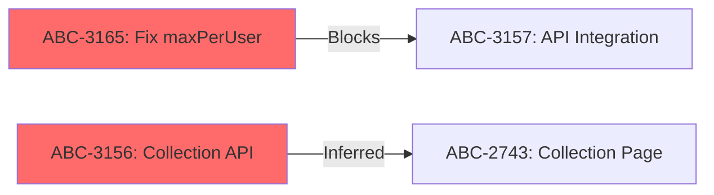

# /map-dependencies

**Role:** Dependency Analyst + Parallel Execution Planner
**Output:** Dependency graph (mermaid) + Critical path + Swim lane plan + Mitigation recommendations

## Workflow

5-phase analysis: Collect → Map → Analyze → Plan → Output

### Phase 1: Collect Sprint Data

Determine scope — sprint ID, issue list, or JQL query:

```text
MCP: jira_search(jql="sprint = <id> ORDER BY rank", fields="summary,status,assignee,issuetype,issuelinks,priority,labels", limit=30)
```

For each item, extract:

- Key, summary, assignee, status, priority
- Issue links (type: Blocks, Relates, Duplicate)
- Size estimate from labels or story points (fallback: infer from issuetype)
- Service tag from summary: `[BE]`, `[FE-Web]`, `[FE-Admin]`, `[QA]`

Load team info:

```text
Read: ../../../references/team-capacity.md (capacity formulas, skill matrix, thresholds)
Read: .claude/project-config.json (team roster: members[], skill_profile, avg_throughput)
```

**Size defaults** (if no estimate available):

| Type | Default |
| --- | --- |
| Bug | S (1.5d) |
| Sub-task | S (1.5d) |
| Story | M (2.5d) |
| Task | M (2.5d) |
| Epic | L (3.5d) |

**Gate:** Data collected — show item count + team members

### Phase 2: Map Dependencies

Build dependency graph from two sources:

**Source A — Explicit (Jira issue links)**

```text
For each item with issuelinks:
  if link.type == "Blocks" → add edge: blocker → blocked (FS dependency)
  if link.type == "Relates" → flag for manual review (may be implicit dependency)
```

**Source B — Inferred (heuristic)**
Analyze items for implicit dependencies not in Jira:

1. **Same API/module**: Multiple tickets touching same endpoint/service → potential merge conflict
2. **FE→BE**: FE ticket references an API from a BE ticket in same sprint → FS dependency
3. **Deploy order**: New FE feature needs new BE endpoint → BE must deploy first
4. **Shared migration**: Multiple DB migrations → must coordinate order
5. **QA→Dev**: QA test plan depends on dev completing feature

For inferred dependencies, mark confidence: HIGH (obvious from context) / MEDIUM (likely) / LOW (possible).

**Output:** Edge list with type and confidence:

```text
ABC-3165 ──[Blocks, HIGH]──> ABC-3157
ABC-3156 ──[Inferred:FE→BE, MEDIUM]──> ABC-2743
```

### Phase 3: Analyze Critical Path

Read reference for algorithm details:

```text
Read: ../../../references/dependency-frameworks.md (section: Critical Path Method)
```

1. Calculate ES/EF for each item (forward pass)
2. Calculate LS/LF for each item (backward pass)
3. Identify critical path (items with zero float)
4. Calculate float for non-critical items
5. Score risks (fan-out, delay impact, team concentration)

**Output tables:**

**Critical Path:**

| Order | Key | Summary | Duration | ES | EF | Assignee | Fan-out |
|-------|-----|---------|----------|----|----|----------|---------|

**Risk Items:**

| Key | Risk Type | Score | Description | Mitigation |
|-----|-----------|-------|-------------|------------|

### Phase 4: Generate Swim Lane Plan

Read reference for scheduling rules:

```text
Read: ../../../references/dependency-frameworks.md (section: Swim Lane Rules)
```

For each team member, schedule items respecting dependencies:

```text
1. Place critical path items first (must start on time)
2. Fill parallel slots with independent items
3. If blocked → assign buffer work (tech-debt, spike, refactor)
4. Apply decoupling patterns where possible:
   - FE blocked by BE? → API Contract First + MSW (see reference)
   - Multiple devs on same module? → Interface-First Development
   - QA blocked by dev? → Start with test plan writing
```

**Present as swim lane table:**

```text
| Day | Alice       | Bob    | Charlie    | Dave       | Eve        |
|-----|-------------|--------|------------|------------|------------|
| 1-2 | ABC-XXX     | ABC-XX | ABC-XX     | ABC-XX     | ABC-XX     |
| 3-4 | ABC-XXX     | ...    | ...        | ...        | ...        |
```

### Phase 5: Output

Generate final deliverable with 4 sections:

**1. Dependency Graph (Mermaid)**



Use red fill for critical path items, default for others.

**2. Critical Path Summary**

- Total critical path duration: X days
- Sprint duration: Y days
- Buffer: Y - X days
- Risk level: LOW (buffer > 2d) / MEDIUM (buffer 1-2d) / HIGH (buffer < 1d)

**3. Swim Lane Execution Plan**
Per-member daily plan with start/end dates, blocking dependencies noted.

**4. Mitigation Recommendations**
Ranked list of actions to reduce blocking:

```text
Priority 1: [Action] — eliminates [N] blocking dependencies
Priority 2: [Action] — reduces delay impact by [N] days
...
```

---

## Options

| Flag | Description |
| --- | --- |
| `--sprint <id>` | Analyze specific sprint (default: current active sprint) |
| `--keys ABC-XX,ABC-YY` | Analyze specific issues instead of full sprint |
| `--team-only` | Show only swim lane plan (skip dependency graph) |
| `--mermaid-only` | Show only mermaid dependency graph |
| `--output jira-comment` | Post result as Jira comment on sprint's first item |

## Examples

### Good

```text
/map-dependencies                               # defaults to current active sprint — resolves via jira_get_sprints_from_board
/map-dependencies --sprint 47                   # sprint ID obtained from jira_get_sprints_from_board(board_id={{BOARD_ID}}, state="active")
/map-dependencies --keys {{PROJECT_KEY}}-210,{{PROJECT_KEY}}-211,{{PROJECT_KEY}}-212  # analyze a specific subset of issues instead of the full sprint
/map-dependencies --sprint 47 --mermaid-only    # output only the dependency graph, skip swim lane and CPM tables
```

### Bad

```text
/map-dependencies --sprint 47                   # ❌ sprint ID hardcoded without calling jira_get_sprints_from_board first (HR7)
/map-dependencies                               # ❌ run without an active sprint and no --keys specified — Phase 1 returns empty scope
/plan-sprint                                    # ❌ wrong skill — /map-dependencies is analysis only; use /plan-sprint to assign work
/map-dependencies --keys {{PROJECT_KEY}}-210               # ❌ single issue with no linked items — dependency graph is meaningless without context
```

**Common mistakes:**

- Using `/map-dependencies` to assign work — this skill produces analysis (graph + swim lane plan) only; execute assignments with `/plan-sprint`
- Not acting on identified blocking dependencies before sprint start — the mitigation recommendations in Phase 5 require manual follow-up
- Passing a very broad sprint scope (30+ items) without `--keys` filtering — inferred dependency detection becomes noisy and slow
- Hardcoding a sprint ID instead of calling `jira_get_sprints_from_board()` first (HR7)

## References

- [Dependency Frameworks](../../../references/dependency-frameworks.md) — Dependency types, CPM algorithm, decoupling patterns, swim lane rules, risk scoring
- [Team Capacity](../../../references/team-capacity.md) — Capacity formulas, skill matrix, thresholds (roster data in project-config.json)
- [Sprint Frameworks](../../../references/sprint-frameworks.md) — Vertical slicing, carry-over model

## 🎓 Domain Expert Notes

### Why This Approach

Dependencies are the primary source of value destruction in Scrum — a single blocking dependency can cascade across multiple team members and sprint goals. This skill applies Critical Path Method (CPM) from classical project management to the sprint timebox: every day of float consumed by an unresolved dependency directly reduces the probability of sprint goal achievement.

### Industry Frameworks Used

| Framework | Applied In | Why |
|-----------|-----------|-----|
| Critical Path Method (CPM) | Phase 3 — ES/EF/LS/LF calculation | Identifies which items have zero float (any delay = sprint goal at risk); developed at DuPont/Remington Rand (1957), still the canonical scheduling algorithm |
| Dependency Structure Matrix (DSM) | Phase 2 — dependency graph construction | DSM (Don Steward, MIT, 1981) represents N×N relationships in a square matrix; reveals circular dependencies and parallel execution opportunities that linear lists miss |
| Conway's Law | Phase 2 — Source B inferred dependencies | "Organizations design systems that mirror their communication structure" — if BE and FE are separate teams, every FE→BE dependency is a Conway coupling that should be explicitly mapped and addressed via API contracts |
| Team Topologies (Skelton/Pais) | Phase 4 — mitigation recommendations | Stream-aligned teams minimize dependencies; platform teams absorb them. When fan-out from one team's items is >3, suggest a platform extraction or API Contract First pattern |
| API Contract First / MSW mocking | Phase 4 — decoupling strategy | Eliminates FE→BE blocking dependency within the sprint by agreeing on interface before implementation; standard in modern frontend development |

### Key Metrics

- **Critical Path Duration:** total calendar days on zero-float chain — if >80% of sprint length, the sprint has no buffer for any delay
- **Fan-out Score:** number of items blocked by a single issue — fan-out >3 = single point of failure; assign to your most reliable team member and protect their capacity
- **Dependency Density:** total edges / total nodes in the graph — healthy: <0.5; >1.0 means more dependencies than items, indicating a sprint that should be replanned
- **Team Concentration Risk:** % of critical path items assigned to one person — >60% concentration is a delivery risk; redistribute or pair
- **Inferred Dependency Accuracy:** % of MEDIUM/LOW inferred deps later confirmed — track over time; improve heuristics when accuracy drops below 50%

### Expert Decision Criteria

- **If critical path buffer < 1 day:** treat as HIGH risk immediately — remove the lowest-priority item from the sprint, not from the critical path
- **If circular dependency detected (A→B→A):** this is a design flaw, not a scheduling problem — escalate to architecture discussion before sprint starts; never schedule circular deps within a single sprint
- **If FE→BE dependency exists and BE has >3 other items:** apply API Contract First pattern — define the OpenAPI/TypeScript interface on Day 1, unblock FE with MSW mock
- **If >40% of items are on the critical path:** the sprint is too tightly coupled; split into two smaller parallel tracks or defer items until dependencies resolve
- **If a dependency is MEDIUM/LOW confidence:** always annotate in the Jira comment rather than creating a formal Jira issue link — premature formalization creates noise

### Common Failure Modes

| Symptom | Root Cause | Expert Fix |
|---------|-----------|-----------|
| Swim lane shows everyone starts Day 1 but items complete on Day 8-9 | Critical path not identified; all items treated as independent | Run CPM first; schedule critical path items with explicit early-start constraints |
| Dependencies found mid-sprint cause replanning | Inferred dependencies not surfaced at planning | Run `/map-dependencies` before sprint planning, not after; treat Phase 2 Source B as mandatory |
| One team member becomes the sprint bottleneck | High fan-out score on their items undetected | Fan-out >3 = reassign one of their dependencies or add a second owner |
| API dependencies cause FE to idle | No decoupling strategy defined | API Contract First + MSW mock should be in the mitigation output for every FE→BE edge |
| Dependency graph too noisy for 30+ item sprints | No filtering applied | Always use `--keys` to scope to the 8-12 highest-priority items; full-sprint graphs are useful only for program-level planning |

### Authoritative References

- **Conway's Law (Melvin Conway, 1968):** "Any organization that designs a system will produce a design whose structure is a copy of the organization's communication structure." — map organizational boundaries first; dependencies that cross team lines are the highest-risk dependencies
- **Critical Path Method (Morgan/Kelly, 1959):** Zero-float items are non-negotiable — they cannot be delayed without delaying the project end date. In sprint context: zero-float = sprint goal risk
- **Team Topologies (Skelton/Pais, 2019):** "Minimizing cognitive load and dependency surface area between teams is the primary architectural goal" — every cross-team dependency in the graph is an architectural smell worth discussing at the sprint level
